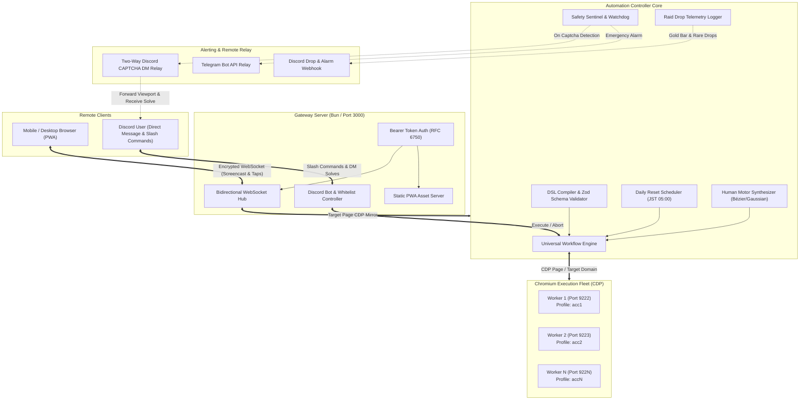

# Granblue Fantasy Remote Controller & Automation Suite

[](https://bun.sh/)
[](https://www.typescriptlang.org/)
[](https://github.com/madacoda/guranburuing/actions/workflows/ci.yml)
[](https://github.com/madacoda/guranburuing/actions/workflows/security.yml)
[](./tests)
[](https://chromedevtools.github.io/devtools-protocol/)
[](./public)
[](./src/relay)
[](./LICENSE)

An enterprise-grade, high-performance, and state-aware automation system and remote mobile cockpit for **Granblue Fantasy (GBF)**. Engineered with native Chrome DevTools Protocol (CDP) bindings, sub-7.5s combat loops, multi-account swarm farming, human biomechanical motor simulation, 2-way Discord remote control with CAPTCHA relay, and an encrypted mobile PWA screencast cockpit.

---

## Table of Contents

- [Key Architectural Highlights](#key-architectural-highlights)
- [System Architecture](#system-architecture)
- [Core Capabilities](#core-capabilities)
  - [1. Declarative Universal Workflow Engine](#1-declarative-universal-workflow-engine)
  - [2. Gold Bar Farming Suite & Tactical Rotations](#2-gold-bar-farming-suite--tactical-rotations)
  - [3. Two-Way Discord Remote Controller & CAPTCHA DM Relay](#3-two-way-discord-remote-controller--captcha-dm-relay)
  - [4. Daily Reset Scheduler Daemon (JST 05:00)](#4-daily-reset-scheduler-daemon-jst-0500)
  - [5. Magna 3 Six-Element Leech Engine](#5-magna-3-six-element-leech-engine)
  - [6. Multi-Account Swarm & Profile Isolation](#6-multi-account-swarm--profile-isolation)
  - [7. Biomechanical Human Motor Simulation](#7-biomechanical-human-motor-simulation)
  - [8. Encrypted Mobile Cockpit (PWA & Screencast)](#8-encrypted-mobile-cockpit-pwa--screencast)
  - [9. Discord Rich Presence Integration](#9-discord-rich-presence-integration)
  - [10. Replicard Sandbox (Zone Mundus) Militis Engine](#10-replicard-sandbox-zone-mundus-militis-engine)
- [Prerequisites](#prerequisites)
- [Quick Start & Workflow Guide](#quick-start--workflow-guide)
  - [Step 1: Account Setup & First-Time Authentication](#step-1-account-setup--first-time-authentication)
  - [Step 2: Running Example Universal Workflows](#step-2-running-example-universal-workflows)
  - [Step 3: Modifying & Creating Custom Workflows](#step-3-modifying--creating-custom-workflows)
  - [Step 4: Specialized Automation Engines & Roster](#step-4-specialized-automation-engines--roster)
- [Configuration Reference](#configuration-reference)
  - [Environment Variables (`.env`)](#environment-variables-env)
  - [Account Registry (`accounts.config.json`)](#account-registry-accountsconfigjson)
- [CLI Command Reference](#cli-command-reference)
  - [Daily Maintenance & Scheduler](#daily-maintenance--scheduler)
  - [Gold Bar & Raid Automation](#gold-bar--raid-automation)
  - [Replicard Sandbox & Militis Bosses](#replicard-sandbox--militis-bosses)
  - [Magna 3 Leeching](#magna-3-leeching)
  - [Remote Gateway, Bot & Discord Presence](#remote-gateway-bot--discord-presence)
  - [Developer Tools & Quality Gates](#developer-tools--quality-gates)
- [Testing & Quality Assurance](#testing--quality-assurance)
- [Repository Layout](#repository-layout)
- [Docker Deployment](#docker-deployment)
- [Security, Hygiene & Anti-Ban Architecture](#security-hygiene--anti-ban-architecture)
- [Contributing & Policies](#contributing--policies)
- [Legal Disclaimer & License](#legal-disclaimer--license)

---

## Key Architectural Highlights

- **Native Bun Runtime**: Instant startup times, zero-overhead TypeScript execution, and fast child-process orchestration without transpilation bloat.
- **Direct CDP Transport**: Eliminates heavy WebDriver overhead by interfacing directly with Chromium's DevTools WebSocket endpoint via `puppeteer-core`.
- **Zero Cold Logins**: Reuses established browser sessions, IndexedDB stores, and auth cookies (`midship`, `access_gbtk`, `t`) in 0ms, avoiding re-authentication triggers.
- **Physical Profile Isolation**: Each worker runs on an isolated `--user-data-dir` and dedicated CDP port to circumvent Chromium's `SingletonLock` process constraints.
- **Biomechanical Motor Modeling**: Emulates human physics with Box-Muller Gaussian distributions, velocity curves, and cubic Bézier pointer movement.
- **Hard Anti-Captcha Tripwire & 2-Way Relay**: Proactive DOM and canvas watcher that halts execution immediately upon detecting verification modals, captures a live honest viewport screenshot, and relays it to Discord DM where the user can solve and resume remotely.
- **Intelligent 3-Raid Limit Handling**: Automatically detects when the active raid backup slot is full, gracefully yields or claims pending rewards, and avoids endless retry locks.

---

## System Architecture



---

## Core Capabilities

### 1. Declarative Universal Workflow Engine
Define farming routines using either human-readable text DSL or strictly typed JSON templates:
- **Sub-7.5s EX+ Meat Farming**: Optimized combat routines with instant animation cancellations via smart reloads.
- **Dynamic Turn Routing**: Condition-based branching, honor threshold targets, and automatic battle result synchronization.
- **Fail-Safe Retries**: Non-retriable material deficit detection vs. transient network backoff.

### 2. Gold Bar Farming Suite & Tactical Rotations
Comprehensive high-difficulty raid farming suite with honor tracking:
- **Proto Bahamut HL (`gb-pbhl` & `gb-pbhl-skill`)**: Dedicated bursting scripts targeting 1.5M honor. Supports pure manual tactical skill execution (e.g. Character 4 Skill 3 → Quick Call → Character 4 Skill 4 → Character 1 Skill 3 → Attack → Summon 2 → Attack) with 0-honors bug prevention and action queue isolation.
- **Akasha HL (`gb-akasha`)**: Dark/Fire burst rotations with automatic key item and weapon drop logging.
- **Grand Order HL (`gb-go`)**: Multi-turn burst optimization targeting Heavenly Horns and Silver Centrums.
- **Permanent Result URLs**: Automatically resolves and archives permanent raid result detail URLs (`#result_multi/detail/${raidId}/1/0/0`).

### 3. Two-Way Discord Remote Controller & CAPTCHA DM Relay
- **Strict Snowflake Authorization**: Only users matching `DISCORD_USER_ID` can trigger commands or receive sensitive screenshots.
- **Interactive Slash Commands**: Run workflows (`/gbf run <template>`), check live health (`/gbf status`), abort running jobs (`/gbf stop`), or trigger daily chores (`/gbf daily`).
- **Two-Way CAPTCHA DM Relay**:
  1. When a CAPTCHA modal appears, the Safety Sentinel halts automation in `<10ms`.
  2. Captures an honest, high-clarity full viewport screenshot (`scratch/captures/captcha/`).
  3. Sends a private Discord DM with the image and an interactive modal button.
  4. The user types the answer directly in Discord.
  5. The bot replays the answer with realistic human typing jitter, clicks "Send" (`.btn-post`), verifies dismissal, and resumes the workflow automatically.

### 4. Daily Reset Scheduler Daemon (JST 05:00)
- **Automatic JST Timing**: Accurately calculates the exact countdown to Japan Standard Time (UTC+9) 05:00:00 reset.
- **Anti-Drift Timer**: Employs wall-clock reconciliation to prevent background process drift.
- **Full Daily Maintenance**:
  - Magna Pro & Hard Pro instant skips
  - Ennead Pro skips
  - 100-Draw Rupie Gacha auto-pull
  - Arcarum Fast Expeditions

### 5. Magna 3 Six-Element Leech Engine
- **Parallel Raid Evaluator**: Multi-slot concurrent checking of raid health, participant count, and optimal entry windows.
- **Primal Supporter Filter**: Validates supporter summon availability matching the element before spending EP.
- **Backup Broadcast Interleaving**: Automatically requests backup assistance with 180-second cooldown tracking.

### 6. Multi-Account Swarm & Profile Isolation
- Parallel execution of multiple accounts without session collisions or database lock contention (`EBUSY`).
- Staggered launch intervals (5–8s randomized offsets) preventing network pattern correlation.
- Independent `--user-data-dir` and dedicated CDP ports (`9222`, `9223`, ...).

### 7. Biomechanical Human Motor Simulation
- **Gaussian Jitter**: Click coordinates and input delays are sampled using Box-Muller Gaussian transforms ($X \sim \mathcal{N}(\mu,\,\sigma^{2})$).
- **Cubic Bézier Interpolation**: Mouse movements simulate biological acceleration, deceleration, and trajectory curvature.
- **Randomized Micro-Pauses**: Simulates human attention variance during multi-hour sessions.

### 8. Encrypted Mobile Cockpit (PWA & Screencast)
- High-efficiency JPEG screencast pipeline streaming live game state at 15–30 FPS with dynamic quality scaling.
- Bidirectional touch/click forwarding translating client viewport coordinates to precise desktop CDP coordinates.
- Mobile PWA installable on iOS and Android home screens with full offline caching and session reconnection.

### 9. Discord Rich Presence Integration
- Live presence status displaying current raid, farming mode, or productivity presets (`gbf`, `work`, `trade`).
- Dynamic elapsed time counters and customizable status quotes.

### 10. Replicard Sandbox (Zone Mundus) Militis Engine
- **Direct Supporter Routing & Fast Deck Confirm**: 0ms supporter skip (`#replicard/supporter/10/10/{div}/{quest_id}/25`) and automatic `.pop-deck.supporter.is-no-supporter` validation.
- **Stage 10 Division Map Resolution**: Real-time division frame tracking on `#replicard/stage/10` with automatic targeting of active Militis/Defender encounters (`[data-is-hell="1"]`).
- **Complete Militis Roster Coverage**: Dedicated burst and Smart Full Auto routines for **Prometheus Militis** (Fire), **Morrigna Militis** (Wind), **Ca Ong Militis** (Water), and **Gilgamesh Militis** (Earth).
- **Smart Full Auto Combat Engine**: Plain Damage Omen countering (Beelzebub summon), Turn 1 Quick Call, Methodological tactical skill prioritization (Field → Debuff → Buff → Nuke → Heal), and F5 animation skip reloads.

---

## Prerequisites

- **Bun Runtime**: v1.2.0 or higher ([Install Bun](https://bun.sh))
- **Chromium-based Browser**: Google Chrome, Chromium, or SRWare Iron
- **PowerShell**: For Windows helper launch scripts (Windows 10/11)

---

## Quick Start & Workflow Guide

### Step 1: Account Setup & First-Time Authentication

1. **Clone & Install Dependencies**:
   ```bash
   git clone https://github.com/madacoda/guranburuing.git
   cd guranburuing
   bun install
   ```

2. **Initialize Configuration**:
   ```bash
   cp .env.example .env
   cp accounts.config.example.json accounts.config.json
   ```

3. **1-Time Assisted Browser Setup**:
   Launch the browser in visible GUI window mode to establish your authenticated session:
   ```bash
   bun run account:setup acc1
   ```
   - Log into your Granblue Fantasy account once (Mobage / DMM / Google) and reach `#mypage`.
   - Your session cookies and IndexedDB storage are permanently stored in an isolated profile directory (`~/.gbf-profiles/acc1`).
   - All subsequent runs can execute 100% headlessly in the background (`Zero Cold Logins`).

---

### Step 2: Running Example Universal Workflows

All combat and farming routines run on the **Universal Workflow Engine** using pre-configured JSON templates in `templates/`:

```bash
# 1. Run Proto Bahamut HL in a visible browser window (inspect rotation):
bun run gb-pbhl:windowed

# 2. Run Proto Bahamut HL in silent background headless mode:
bun run gb-pbhl

# 3. Specify custom run count and account:
bun src/cli/run-workflow.ts acc1 gb-pbhl 20

# 4. Interactive Terminal Selector (UI Menu):
bun run workflow
```
*(The interactive picker auto-discovers all templates, allows arrow-key selection, and prompts for account and run count).*

---

### Step 3: Modifying & Creating Custom Workflows

You can freely modify any existing template (like [`templates/gb-pbhl.json`](file:///c:/laragon/www/gbf/templates/gb-pbhl.json)) or create brand-new farming routines.

#### Anatomy of a Template (`templates/gb-pbhl.json`)
```json
{
  "name": "GB Farm - Proto Bahamut HL",
  "questUrl": "https://game.granbluefantasy.jp/#quest/assist",
  "raidSlot": 4,
  "targetScore": 1500000,
  "supporterPriority": ["Agni", "Bahamut", "Shiva"],
  "autoBerry": true,
  "speedProfile": "fast",
  "steps": [
    { "code": "skill", "character": 4, "skill": 3, "optional": true, "waitForNetwork": "ability_result.json" },
    { "code": "reload" },
    { "code": "quick_call" },
    { "code": "reload" },
    { "code": "attack" },
    { "code": "reload" },
    { "code": "summon", "slot": 2, "waitForNetwork": "summon_result.json" },
    { "code": "reload" },
    {
      "code": "repeat",
      "repeatCount": 10,
      "subSteps": [
        { "code": "exit_if_score", "targetScore": 1500000 },
        { "code": "attack" },
        { "code": "reload" }
      ]
    },
    { "code": "confirm_result" }
  ]
}
```

#### Step Action Catalog
| Action Code | Key Parameters | Description |
| :--- | :--- | :--- |
| `skill` | `character` (1-4), `skill` (1-4), `targetCharacter` (opt) | Casts character ability |
| `quick_call` | — | Triggers designated Quick Summon |
| `summon` | `slot` (1-6) | Summons sub-aura summon from slot 1-6 |
| `attack` | — | Executes normal attack |
| `reload` | — | Fast F5 page reload (skips combat animation) |
| `tap_ready` | — | Taps Ready banner or toggles in-game Full Auto |
| `smart_full_auto` | `maxTurns`, `postAttackWaitMs` | Methodological tactical skills (Debuff $\rightarrow$ Buff $\rightarrow$ Nuke) |
| `repeat` | `repeatCount`, `subSteps` | Repeats enclosed list of actions in a loop |
| `exit_if_score` | `targetScore` (e.g. `1500000`) | Exits combat early once target honors are achieved |
| `target_enemy` | `enemyIndex` (1-3) | Switches focus to specified enemy target |
| `heal` | `item` (`green_potion` \| `blue_potion`) | Consumes healing item |
| `backup_request` | — | Broadcasts backup request to Everyone/Friends/Crew |
| `confirm_result` | — | Dismisses victory screen, collects loot, loops |

#### Validating Your Changes
Before running modified or new templates, validate them against the Zod schema:
```bash
bun run workflow:validate
```
*Catches missing fields, invalid slot numbers, out-of-range character indices, or malformed URLs.*

#### 4 Ways to Run Your Modified or New Workflow
1. **Direct CLI Runner**:
   ```bash
   bun src/cli/run-workflow.ts acc1 gb-pbhl 20 --windowed
   ```
2. **Account Shortcut Syntax**:
   ```bash
   bun run acc1 gb-pbhl 20
   bun run acc1 my-custom-raid 10 --windowed
   ```
3. **Auto-Generate NPM Scripts (`templates:sync`)**:
   ```bash
   bun run templates:sync
   ```
   *Automatically registers `bun run my-custom-raid` and `bun run my-custom-raid:windowed` in `package.json`!*
4. **Interactive Terminal Menu**:
   ```bash
   bun run workflow
   ```

*For complete details, see the [Modifying & Creating Workflows Developer Guide](./docs/workflows/creating-and-modifying-workflows.md).*

---

### Step 4: Specialized Automation Engines & Roster

The suite includes dedicated, battle-tested automation engines for every sector of Granblue Fantasy:

| Sector | Primary Commands | Capabilities |
| :--- | :--- | :--- |
| **Daily Maintenance** | `bun run daily`<br/>`bun run daily:all` | 12 Pro Skips, 100-Draw Rupie Gacha, Skyscope missions, Casino pots |
| **Daily Raid Hosting** | `bun run daily:host`<br/>`bun run daily:host:hl` | Hosts all daily 16-raid rotation (HL, Magna 3, Six Dragons) with retry pass |
| **05:00 JST Scheduler** | `bun run daily:scheduler`<br/>`bun run daily:routine` | 24/7 background daemon executing daily reset chores at 05:00:15 JST |
| **Arcarum: Zone Mundus** | `bun run prometheus:smart`<br/>`bun run morrigna:smart`<br/>`bun run ca-ong:smart`<br/>`bun run gilgamesh:smart`<br/>`bun run stage10` | 0ms supporter select, Defender & Militis Smart Full Auto, AAP recovery |
| **Arcarum: The World** | `bun run arcarum-theworld` | Zone Mundus boss with Plain Damage Omen counter (Beelzebub) |
| **Gold Bar (GB) Hunting** | `bun run gb-pbhl`<br/>`bun run gb-pbhl:skill`<br/>`bun run gb-akasha`<br/>`bun run gb-go`<br/>`bun run gb-farm` | Blue Chest honor burst loops (PBHL, Akasha, GOHL), permanent URL archives |
| **Magna 3 Fast Leech** | `bun run leech:colossus`<br/>`bun run leech:tiamat`<br/>`bun run leech:leviathan` | HP $\le 20\%$ entry filter, primal supporter match, 1-turn burst, immediate exit |
| **Guild Wars (U&F)** | `bun run gw-meat`<br/>`bun run gw-nm95-light`<br/>`bun run gacha:unf` | Sub-7.5s EX+ meat farm, NM95 1-turn burst (14s), token drawbox clearer |
| **Fate Episodes** | `bun run fate`<br/>`bun run fate:10`<br/>`bun run fate:all` | Fast dialog skip, battle auto-resolution, uncap material & crystal farming |
| **Scenario Events** | `bun run event`<br/>`bun run event:all`<br/>`bun run event:gacha` | Collab & scenario event story skip, daily maniacs, HELL batch skip, gacha |
| **Rise of the Beasts** | `bun run rotb:baihu`<br/>`bun run rotb:earth:loop` | Continuous 9x Extreme Baihu $\rightarrow$ 1x Titan Agon farming cycle |
| **Mobile Web Cockpit** | `bun run gateway` | Phone/tablet remote PWA, live screencast, tap forwarding, emergency abort |
| **Discord Bot & Relay** | `bun run discord:bot`<br/>`bun run discord:controller` | 2-Way CAPTCHA DM Relay, remote `/run`, `/status`, and `/stop` slash commands |

---

## Configuration Reference

### Environment Variables (`.env`)

| Variable | Type | Default | Description |
| :--- | :--- | :--- | :--- |
| `PORT` | `number` | `3000` | Port for the WebSocket gateway and PWA static server |
| `HOST` | `string` | `0.0.0.0` | Bind host address |
| `AUTH_TOKEN` | `string` | *(default fallback)* | Bearer token for client authentication (min 16 chars) |
| `CDP_PORT` | `number` | `9222` | Default Chrome DevTools Protocol port |
| `HEADLESS` | `boolean` | `false` | Headless execution mode (`--headless=new`) |
| `AUTO_LAUNCH_CHROME` | `boolean` | `true` | Automatically launch Chromium if inactive |
| `EXECUTION_MODE` | `enum` | `hybrid` | Execution mode (`hybrid` \| `dom`) |
| `SPEED_PROFILE` | `enum` | `fast` | Action timing profile (`stealth` \| `fast` \| `turbo`) |
| `COMBAT_AUTO_REFRESH`| `boolean` | `true` | Fast combat reload animation cancellation |
| `DISCORD_BOT_TOKEN` | `string` | — | Discord Bot Token for 2-Way CAPTCHA Relay & Controller |
| `DISCORD_USER_ID` | `string` | — | Your Discord User Snowflake ID for DM Relay authorization |
| `DISCORD_WEBHOOK_URL`| `string` | — | Discord Webhook URL for alarm and drop broadcasts |
| `TELEGRAM_BOT_TOKEN` | `string` | — | Telegram Bot API token for emergency alarms |
| `TELEGRAM_CHAT_ID` | `string` | — | Destination chat ID for Telegram alarms |
| `DRY_STREAK_MODE` | `enum` | `blue_chest`| Streak tracking mode (`blue_chest` \| `min_honor` \| `all_battles`) |

### Account Registry (`accounts.config.json`)

```json
[
  {
    "id": "acc1",
    "name": "Main Account",
    "enabled": true,
    "service": "mobage",
    "cdpPort": 9222,
    "profileDir": "./data/accounts/acc1",
    "credentials": {
      "email": "your-acc1-email@example.com",
      "password": "your-acc1-password"
    },
    "proxy": null
  }
]
```

> [!CAUTION]
> Never commit `accounts.config.json` or `.env` to source control. Both are strictly ignored by `.gitignore` and enforced by pre-flight hygiene gates.

---

## CLI Command Reference

### Daily Maintenance & Scheduler

| Command | Description |
| :--- | :--- |
| `bun run daily` | Executes full daily cycle: Magna Pro, Hard Pro, Rupie Gacha, Arcarum |
| `bun run daily:acc1` | Runs daily cycle specifically for Account 1 |
| `bun run daily:all` | Swarm mode: runs daily cycle across all enabled accounts |
| `bun run daily:windowed` | Runs daily cycle with visible browser window |
| `bun run daily:host` | Hosts all daily 16-raid rotation (HL, Magna 3, Six Dragons) |
| `bun run daily:scheduler` | Starts background daemon that triggers dailies at JST 05:00 |

### Gold Bar & Raid Automation

| Command | Description |
| :--- | :--- |
| `bun run gb:pbhl` | Proto Bahamut HL burst farm with honor guard target |
| `bun run gb:pbhl-skill` | PBHL precise manual skill rotation (C4S3 → Call → C4S4 → C1S3 → Attack) |
| `bun run gb:pbhl-skill:windowed`| PBHL precise manual rotation with visible browser window |
| `bun run gb:akasha` | Akasha HL burst farm for Gold Bar drops |
| `bun run gb:go` | Grand Order HL farm for Heavenly Horns & Silver Centrums |
| `bun run gw-meat` | Light EX+ Guild Wars sub-7.5s meat farming loop |

### Replicard Sandbox & Militis Bosses

| Command | Description |
| :--- | :--- |
| `bun run arcarum-prometheus:smart` | Prometheus Militis (Fire / Div 3) Smart Full Auto |
| `bun run arcarum-prometheus` | Prometheus Militis fast burst rotation |
| `bun run arcarum-morrigna:smart` | Morrigna Militis (Wind / Div 15) Smart Full Auto |
| `bun run arcarum-morrigna` | Morrigna Militis fast burst rotation |
| `bun run arcarum-ca-ong:smart` | Ca Ong Militis (Water / Div 9) Smart Full Auto |
| `bun run arcarum-ca-ong` | Ca Ong Militis fast burst rotation |
| `bun run arcarum-gilgamesh:smart` | Gilgamesh Militis (Earth / Div 8) Smart Full Auto |
| `bun run arcarum-gilgamesh` | Gilgamesh Militis fast burst rotation |
| `bun run arcarum-stage10:smart` | Zone Mundus Stage 10 Map auto-targeting active Militis/Defenders |
| `bun run arcarum-theworld` | Zone Mundus Boss: The World with plain damage omen counters |

### Magna 3 Leeching

| Command | Description |
| :--- | :--- |
| `bun run leech:m3` | Multi-element Magna 3 leech evaluator loop |
| `bun run leech:tiamat` | Tiamat Aura Magna 3 leech |
| `bun run leech:colossus` | Colossus Ira Magna 3 leech |
| `bun run leech:leviathan` | Leviathan Mare Magna 3 leech |
| `bun run leech:yggdrasil` | Yggdrasil Arbos Magna 3 leech |
| `bun run leech:luminiera` | Luminiera Creed Magna 3 leech |
| `bun run leech:celeste` | Celeste Zant Magna 3 leech |

### Remote Gateway, Bot & Discord Presence

| Command | Description |
| :--- | :--- |
| `bun run gateway` | Starts the WebSocket companion & mobile PWA server |
| `bun run discord:bot` | Starts Discord 2-Way CAPTCHA DM Relay & Remote Controller |
| `bun run presence:gbf` | Sets Discord Rich Presence to live GBF farming state |
| `bun run presence:work` | Sets Discord Rich Presence to Productivity mode |
| `bun run presence:trade` | Sets Discord Rich Presence to Trading mode |
| `bun run presence:clear` | Clears active Discord Rich Presence |

### Developer Tools & Quality Gates

| Command | Description |
| :--- | :--- |
| `bun run test` | Executes unified test runner (33/33 suites passing) |
| `bun run verify` | Full pre-flight gate: Security audit + DSL check + Build + Tests |
| `bun run hygiene` | Scans git index for secret leaks, credentials, or personal paths |
| `bun run workflow:validate` | Validates all JSON & DSL templates against Zod schemas |
| `bun run build` | Compiles TypeScript codebase (`tsc`) |

---

## Testing & Quality Assurance

The codebase features an exhaustive, senior-grade test suite covering every core subsystem:

```bash
# Run complete test suite (33 suites)
bun run test

# Run full pre-flight verification gate
bun run verify
```

### Verified Test Gates (33/33 Passing):
1. **Workflow Template Schema & Boundary Tests**: Schema guarantees, edge case checking, and structural validation.
2. **Advanced DSL Compiler & Round-Trip Serializer**: Bidirectional compiler fidelity between text DSL and AST JSON.
3. **Universal Engine Unit & Telemetry Mock Tests**: State machines, Gold Bar drop listeners, and input lock handling.
4. **Human Motor Biomechanical Math**: Validates Box-Muller Gaussian jitter distributions and cubic Bézier interpolation.
5. **ProSkip Daily Reconciliation**: Verification of daily Pro Skip execution flow and modal reconciliation.
6. **Raid Engine State Machine & Recovery**: Backup limit detection (3-raid limit recovery), network retries, and raid joins.
7. **Template Parser Backwards Compatibility**: Legacy schema upgrade and validation.
8. **Daily Universal Routine & Reconnect Logic**: Network disruption resilience and retry loops.
9. **Rupie Gacha Automation**: Tab isolation and multi-pull 100-draw execution.
10. **3-Raid Backup Limit Detection & Recovery**: Active raid slot reclamation and queue clearing.
11. **Event Engine & Scenario Story Unit Tests**: Event quest automation and skip handling.
12. **Gold Bar Tracker & Battle URL Integration**: Gold Bar detection and permanent archive URL generation.
13. **CAPTCHA Detection & Safety Sentinel**: DOM modal observation and zero-latency halt.
14. **Notification Deduplication & Anti-Spam**: Prevents notification spam across Discord and Telegram.
15. **Raid Evaluator & Score-Based Decision**: Priority queueing and dynamic scoring.
16. **Session & Cookie Synchronization**: Cross-platform path normalization and token persistence.
17. **Discord Presence Multi-Template**: Presence status formatting and quote switching.
18. **Arcarum: The World Template & AAP Engine**: Zone Mundus quest start and AAP recovery modals.
19. **Granblue Fantasy Tactical Skills**: Field → Debuff → Buff → Nuke ordering and cooldown checks.
20. **PBHL Universal Workflow & Shorthand DSL**: Burst rotation syntax and named summon resolution.
21. **Magna 3 Leech & Fast Burst 6-Element Evaluator**: Supporter validation and assist limit recovery.
22. **Raid Evaluator Parallel Multi-Condition**: O(1) lookups, disqualification bitmasks, and LRU cache.
23. **Daily Host Engine & 16-Raid Catalog**: HL, Magna 3, and Six Dragons daily host verification.
24. **Senior Data Architecture & Catalog**: Modular data catalog schema compliance and O(1) lookups.
25. **Backup Broadcast Scope & 3-Min Cooldown**: Everyone/Friends/Crew checkboxes and 180s cooldown re-broadcasting.
26. **Dual-Track Assist Interleaving**: Frontline wipeout triage and assist farming interleaving.
27. **Failure Diagnostic Classifier**: Material deficit vs. transient network error triage.
28. **Daily Reset Scheduler Daemon & JST Math**: Anti-drift JST reset calculation and scheduling.
29. **Discord Remote Controller Security & Whitelist**: Snowflake ID verification and injection prevention.
30. **PBHL 0-Honors Bug Critical Verification**: Result isolation, combat turn gating, and honors synchronization.
31. **Two-Way Discord CAPTCHA Relay & Anti-Deadlock**: Single honest viewport attachment, typing jitter, and circular lock resolution.
32. **PBHL Precise Manual Skill Flow**: `tap_ready` elimination, optional fallback flags, and exact tactical skill/summon sequences.
33. **Arcarum Zone Mundus (Stage 10) Militis Bosses**: Validates all Prometheus, Morrigna, Ca Ong, and Gilgamesh Militis templates, DSL round-trip fidelity, and stage map division frame quest resolution.

---

## Repository Layout

```text
├── .github/                 # GitHub Actions CI & Security workflows, PR template
├── data/                    # JSON data catalog (raids, summons, classes, quests)
├── docs/                    # Technical documentation and guides
├── public/                  # Remote PWA mobile client (HTML5, CSS, Canvas screencast)
├── scripts/                 # PowerShell & Bun helper automation scripts
├── src/
│   ├── cli/                 # CLI entry points (daily, gold bar, host, presence)
│   ├── config.ts            # Centralized Zod-validated environment configuration
│   ├── engines/             # Core engines (Universal Workflow, Leech, Host, Drop Logger)
│   ├── gateway/             # WebSocket and HTTP companion server
│   ├── relay/               # Two-Way Discord CAPTCHA DM Relay & Remote Controller
│   ├── templates/           # Template parsers, DSL compiler, and AST serializer
│   ├── types/               # TypeScript interfaces and domain models
│   ├── utils/               # Biomechanical mouse, math, logging, and CDP helpers
│   └── sentinel-watchdog.ts # Safety Sentinel tripwire & anti-ban observer
├── strategies/              # DSL workflow strategies and natural language command guides
├── templates/               # Reusable JSON workflow templates (PBHL, Akasha, Magna 3, Dailies)
├── tests/                   # 33 comprehensive unit and integration test suites
├── accounts.config.example.json # Template for multi-account configuration
├── .env.example             # Comprehensive environment configuration template
└── package.json             # NPM / Bun package manifest and CLI script registry
```

---

## Docker Deployment

Run the remote gateway and automation engine in an isolated Linux container with pre-configured Chromium:

```bash
# Build container image
docker build -t guranburuing .

# Run container with environment configuration
docker run -d \
  --name gbf-remote \
  -p 3000:3000 \
  -e AUTH_TOKEN=your_secure_bearer_token_here \
  guranburuing
```

---

## Security, Hygiene & Anti-Ban Architecture

- **Zero Secrets Policy**: Strict `.gitignore` policy forbids credentials (`accounts.config.json`), tokens (`.env`), session cookies (`*-cookies.json`), and temporary screen captures from entering version control.
- **Automated Hygiene Gate**: `bun run hygiene` runs locally and in CI to audit 100% of tracked files against secret leaks, personal paths, and private endpoints.
- **Local Isolation**: Browser instances execute strictly inside dedicated local sandboxes without transmitting session cookies to third-party endpoints.
- **Proactive Fail-Safe Circuit Breaker**: Immediate process termination upon detection of captcha or session invalidation.

---

## Contributing & Policies

We welcome contributions adhering to **Gold Industry Standards**!

- **Contributing Guide**: See [CONTRIBUTING.md](./CONTRIBUTING.md) for branch naming, PR templates, and Conventional Commit guidelines.
- **Security Policy**: See [SECURITY.md](./SECURITY.md) for vulnerability disclosure and threat modeling.
- **Code of Conduct**: See [CODE_OF_CONDUCT.md](./CODE_OF_CONDUCT.md) for community standards.

Before submitting any Pull Request:
```bash
bun run verify
```

---

## Legal Disclaimer & License

This software is developed strictly for educational, research, and personal workflow automation purposes. Granblue Fantasy is a registered trademark of Cygames, Inc. This project is not affiliated with, endorsed by, or associated with Cygames. Use of automation tools may violate the Granblue Fantasy Terms of Service; users assume all operational risks.

Distributed under the [MIT License](./LICENSE).
