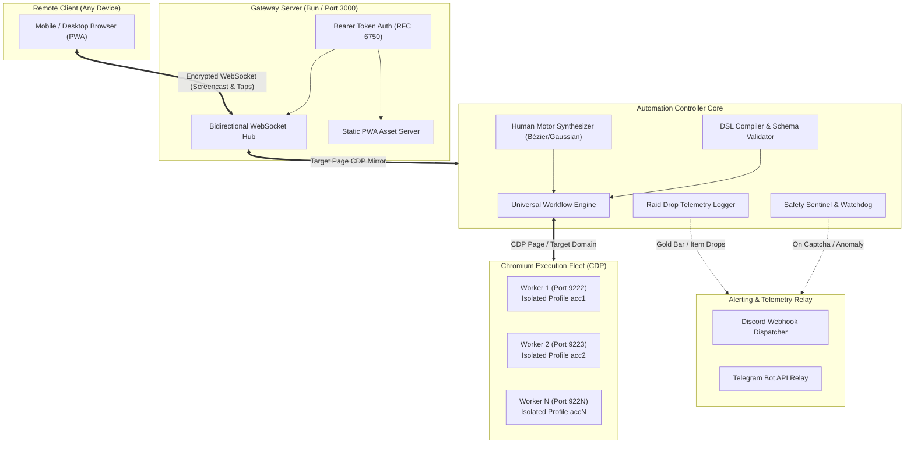

# Granblue Fantasy Remote Controller & Automation Suite

[](https://bun.sh/)
[](https://www.typescriptlang.org/)
[](https://github.com/madacoda/guranburuing/actions/workflows/ci.yml)
[](https://github.com/madacoda/guranburuing/actions/workflows/security.yml)
[](https://chromedevtools.github.io/devtools-protocol/)
[](./public)
[](./LICENSE)

A high-performance, resilient, and state-aware automation system and remote mobile cockpit for **Granblue Fantasy (GBF)**. Engineered with native Chrome DevTools Protocol (CDP) bindings, sub-7.5s battle loops, multi-account swarm farming, human biomechanical motor simulation, proactive anti-cheat tripwires, and encrypted remote management.

---

## Table of Contents

- [Key Architectural Highlights](#key-architectural-highlights)
- [System Architecture](#system-architecture)
- [Core Capabilities](#core-capabilities)
  - [1. Declarative Workflow Engine](#1-declarative-workflow-engine)
  - [2. Multi-Account Swarm & Profile Isolation](#2-multi-account-swarm--profile-isolation)
  - [3. Sentinel Safety & Biomechanical Anti-Ban](#3-sentinel-safety--biomechanical-anti-ban)
  - [4. Encrypted Remote Cockpit (PWA & Screencast)](#4-encrypted-remote-cockpit-pwa--screencast)
- [Prerequisites](#prerequisites)
- [Quick Start Guide](#quick-start-guide)
- [Configuration Reference](#configuration-reference)
  - [Environment Variables (`.env`)](#environment-variables-env)
  - [Account Registry (`accounts.config.json`)](#account-registry-accountsconfigjson)
- [CLI Workflow Reference](#cli-workflow-reference)
- [Testing & Quality Assurance](#testing--quality-assurance)
- [Security & Hygiene Policy](#security--hygiene-policy)
- [Legal Disclaimer & License](#legal-disclaimer--license)

---

## Key Architectural Highlights

- **Native Bun Runtime**: Instant startup times, zero-overhead TypeScript execution, and fast child-process orchestration without transpilation bloat.
- **Direct CDP Transport**: Eliminates heavy WebDriver overhead by interfacing directly with Chromium's DevTools WebSocket endpoint via `puppeteer-core`.
- **Zero Cold Logins**: Reuses established browser sessions, IndexedDB stores, and auth cookies (`midship`, `access_gbtk`, `t`) in 0ms, avoiding unnecessary re-authentication triggers.
- **Physical Profile Isolation**: Each worker runs on an isolated `--user-data-dir` and dedicated CDP port to circumvent Chromium's `SingletonLock` process constraints.
- **Biomechanical Motor Modeling**: Emulates human physics with Box-Muller Gaussian distributions, velocity curves, and cubic Bézier pointer movement.
- **Hard Anti-Captcha Tripwire**: Proactive DOM and canvas watcher that halts execution immediately upon detecting verification modals, sounding instant alarms across Telegram and Discord.

---

## System Architecture



---

## Core Capabilities

### 1. Declarative Workflow Engine
Define farming routines using intuitive DSL text or strictly validated JSON templates:
- **Sub-7.5s EX+ Meat Farming**: Optimized combat routines with instant animation cancellations via smart reloads.
- **Gold Bar Hunter**: Automated Proto Bahamut HL (`gb-pbhl`), Akasha HL (`gb-akasha`), and Grand Order HL (`gb-go`) farming loops with honor-threshold targets and automatic backup limit handling.
- **One-Click Daily Routines**: Fully automated Magna Pro, Hard Pro, Ennead Pro, 100-Draw Rupie Gacha, and Arcarum Fast Expeditions.

### 2. Multi-Account Swarm & Profile Isolation
- Parallel execution of multiple accounts without session collisions or database lock contention (`EBUSY`).
- Staggered launch intervals (5–8s randomized offsets) preventing network pattern correlation.
- Lazy, on-demand session verification.

### 3. Sentinel Safety & Biomechanical Anti-Ban
- **Human Motor Jitter**: Click coordinates and input delays are sampled using Box-Muller Gaussian transforms ($X \sim \mathcal{N}(\mu,\,\sigma^{2})$).
- **Proactive Captcha Freeze**: Real-time DOM observers inspect for anti-bot modals (`.pop-captcha`, `#pop-captcha`, `div[class*="captcha"]`). Detection triggers an unconditional engine halt and captures an artifact screenshot.
- **Rate-Limiting Circuit Breakers**: Prevents cascade failures or repetitive request loops when encountering unexpected maintenance or network drops.

### 4. Encrypted Remote Cockpit (PWA & Screencast)
- High-efficiency JPEG screencast pipeline streaming live game state at 15–30 FPS with dynamic quality scaling.
- Bidirectional touch/click forwarding translating client viewport coordinates to precise desktop CDP coordinates.
- Mobile PWA installable on iOS and Android home screens with full offline caching and session reconnection.

---

## Prerequisites

- **Bun Runtime**: v1.2.0 or higher ([Install Bun](https://bun.sh))
- **Chromium-based Browser**: Google Chrome, Chromium, or SRWare Iron
- **PowerShell**: For Windows helper launch scripts

---

## Quick Start Guide

### 1. Clone & Install Dependencies
```bash
git clone https://github.com/madacoda/guranburuing.git
cd guranburuing
bun install
```

### 2. Initialize Environment Configuration
```bash
cp .env.example .env
cp accounts.config.example.json accounts.config.json
```
Edit `.env` to configure your chosen gateway port, auth bearer token, and optional alert webhooks.

### 3. Launch Browser in Debugging Mode
Use the provided PowerShell script to launch an isolated Chromium session on port `9222`:
```powershell
powershell -ExecutionPolicy Bypass -File .\scripts\launch-gbf-chrome.ps1
```

### 4. Run One-Click Daily Maintenance
```bash
bun run daily
```

### 5. Launch the Remote Gateway Server (Optional)
```bash
bun run gateway
```
Open `http://localhost:3000` on your mobile device or desktop to view the live dashboard and screencast.

---

## Configuration Reference

### Environment Variables (`.env`)

| Variable | Type | Default | Description |
| :--- | :--- | :--- | :--- |
| `PORT` | `number` | `3000` | Port for the WebSocket gateway and PWA static server |
| `HOST` | `string` | `0.0.0.0` | Bind host address |
| `AUTH_TOKEN` | `string` | — | Bearer token for client authentication (min 16 chars) |
| `CDP_PORT` | `number` | `9222` | Default Chrome DevTools Protocol port |
| `HEADLESS` | `boolean` | `true` | Headless execution mode (`--headless=new`) |
| `SPEED_PROFILE` | `enum` | `fast` | Action timing profile (`careful` \| `normal` \| `fast`) |
| `COMBAT_AUTO_REFRESH` | `boolean` | `true` | Smart reload animation cancel |
| `TELEGRAM_BOT_TOKEN` | `string` | — | Telegram Bot API token for emergency alarms |
| `TELEGRAM_CHAT_ID` | `string` | — | Destination chat ID for Telegram alarms |
| `DISCORD_WEBHOOK_URL`| `string` | — | Discord Webhook URL for alarm and drop broadcasts |

### Account Registry (`accounts.config.json`)

```json
[
  {
    "id": "acc1",
    "name": "Main Account",
    "enabled": true,
    "service": "mobage",
    "cdpPort": 9222,
    "profileDir": "C:/Users/YOUR_USER/.gbf-profiles/acc1"
  }
]
```

> [!CAUTION]
> Never commit `accounts.config.json` or `.env` to source control. Both are strictly ignored by `.gitignore`.

---

## CLI Workflow Reference

| Command | Description |
| :--- | :--- |
| `bun run daily` | Executes full daily cycle: Magna Pro, Hard Pro, Rupie Gacha, Arcarum |
| `bun run daily:magna` | Executes Magna Pro skip only |
| `bun run daily:hard` | Executes Hard Pro skip only |
| `bun run gb:pbhl` | Farms Proto Bahamut HL until target honor or run limit |
| `bun run gb:akasha` | Farms Akasha HL for Gold Bar drops |
| `bun run gb:go` | Farms Grand Order HL for Heavenly Horns & Silver Centrums |
| `bun run gw-meat` | Light EX+ Guild Wars sub-7.5s meat farming loop |
| `bun run gw-meat:swarm` | Swarm mode: runs all enabled accounts concurrently |
| `bun run workflow:validate` | Validates all JSON & DSL templates against Zod schemas |
| `bun run test` | Executes comprehensive test suite (100% passing) |
| `bun run verify` | Full pre-flight gate: Secret audit + templates + tests + build |

---

## Testing & Quality Assurance

The codebase includes comprehensive unit, integration, and mathematical correctness test suites:

```bash
# Run unit & integration test suites
bun run test

# Run full pre-flight verification gate (Audit + Templates + Tests + Typecheck)
bun run verify
```

### Verified Test Gates:
1. **Workflow Template Schema & Boundary Tests**: Schema guarantees, edge case checking, and structural validation.
2. **Advanced DSL Compiler & Round-Trip Serializer**: Bidirectional compiler fidelity between text DSL and AST JSON.
3. **Universal Engine Unit & Telemetry Mock Tests**: State machines, Gold Bar drop listeners, and input lock handling.
4. **Human Motor Biomechanical Math**: Validates Box-Muller Gaussian jitter distributions and cubic Bézier interpolation.
5. **ProSkip Daily Reconciliation**: Verification of daily Pro Skip execution flow and modal reconciliation.
6. **Raid Engine State Machine & Recovery**: Backup limit detection (3-raid limit recovery), network retries, and raid joins.
7. **Rupie Gacha Automation**: Anti-false-positive tab verification and multi-pull execution.

---

## Docker Deployment (Headless Gateway)

Run the remote gateway and automation engine in an isolated Linux container with pre-configured Chromium:

```bash
# Build container image
docker build -t guranburuing .

# Run container with environment configuration
docker run -d \
  --name gbf-remote \
  -p 3000:3000 \
  -e AUTH_TOKEN=your_secure_bearer_token_here \
  guranburuing
```

---

## Security, Hygiene & Community Policies

- **Security Policy**: See [SECURITY.md](./SECURITY.md) for vulnerability reporting and threat modeling.
- **Contributing Guidelines**: See [CONTRIBUTING.md](./CONTRIBUTING.md) for PR standards and conventional commit rules.
- **Code of Conduct**: See [CODE_OF_CONDUCT.md](./CODE_OF_CONDUCT.md) for community standards.
- **No Secrets in Repo**: Strict `.gitignore` policy forbids credentials (`accounts.config.json`), tokens (`.env`), session files, and media captures from entering version control.
- **Local Isolation**: Browser instances execute strictly inside dedicated local sandboxes without transmitting session cookies to third-party endpoints.
- **Fail-Safe Circuit Breaker**: Immediate process termination upon detection of captcha or session invalidation.

---

## Legal Disclaimer & License

This software is developed strictly for educational, research, and personal workflow automation purposes. Granblue Fantasy is a registered trademark of Cygames, Inc. This project is not affiliated with, endorsed by, or associated with Cygames. Use of automation tools may violate the Granblue Fantasy Terms of Service; users assume all operational risks.

Distributed under the [MIT License](./LICENSE).
