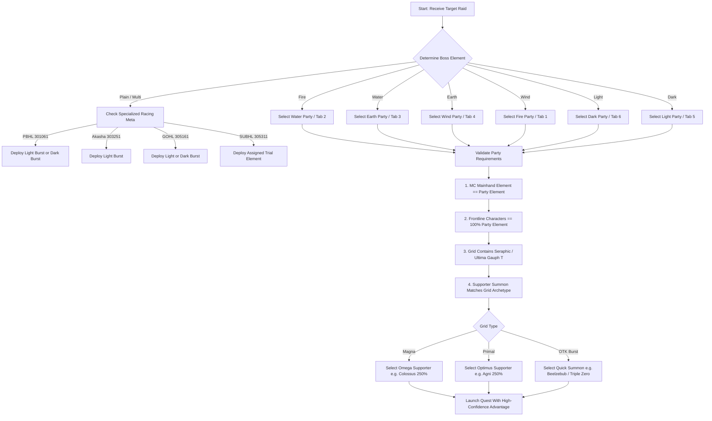

# Volume 8: Elemental Mechanics, Damage Physics, and Automated Party Optimization

## 1. Executive Summary & Scope

In Granblue Fantasy (GBF), the elemental system is the foundational pillar governing damage output, defense calculations, critical hit eligibility, status ailment accuracy, and weapon grid synergies. 

For high-performance automation engines, telemetry observers, and automated party selectors, understanding elemental affinities is not merely a theoretical exercise—it directly dictates:
1. **Target Selection & Deck Routing**: Determining which party deck (`#party/index/0/deck_id`) to deploy against a target raid.
2. **Supporter Summon Dispatch**: Automatically navigating the `#cnt-supporter` attribute tabs (`data-attribute="1..7"`) to lock in the optimal summon aura (e.g. Varuna vs Agni vs Hades).
3. **Turn-One Damage Viability**: Ensuring that burst racing configurations hit blue chest contribution thresholds (e.g. 1.48M honors in PBHL / 1.56M in Akasha) without being crippled by off-element damage penalties.

```
                  THE GRANBLUE FANTASY ELEMENTAL WHEEL

               [FIRE (火)]  ───(Strong to)───>  [WIND (風)]
                    ^                                |
                    | (Weak to)                      | (Strong to)
                    |                                v
               [WATER (水)] <───(Strong to)─── [EARTH (土)]

          ────────────────────────────────────────────────────────
                      THE LIGHT / DARK POLARITY AXIS

               [LIGHT (光)]  <──(Mutual Advantage)──>  [DARK (闇)]
          ────────────────────────────────────────────────────────
```

---

## 2. Internal Game Architecture & Client Protocols

### 2.1 Internal Element Encoding
Granblue Fantasy internally represents elements using integer codes across REST payloads, character status packets, quest definitions, and DOM data attributes:

| Element | Internal ID (`attr`) | Kanji | Hex Color | Supporter Tab Selector | Weapon Skill Prefix (Magna / Primal) |
| :--- | :---: | :---: | :---: | :--- | :--- |
| **Fire** | `1` | 火 | `#ef4444` | `.prt-attribute-tab[data-attribute='1']` | *Hellfire's* (機炎) / *Fire's* (紅蓮) |
| **Water** | `2` | 水 | `#3b82f6` | `.prt-attribute-tab[data-attribute='2']` | *Tsunami's* (海神) / *Water's* (渦流) |
| **Earth** | `3` | 土 | `#d97706` | `.prt-attribute-tab[data-attribute='3']` | *Mountain's* (創樹) / *Earth's* (大地) |
| **Wind** | `4` | 風 | `#10b981` | `.prt-attribute-tab[data-attribute='4']` | *Storm's* (嵐竜) / *Wind's* (乱気) |
| **Light** | `5` | 光 | `#f59e0b` | `.prt-attribute-tab[data-attribute='5']` | *Luminiera's* (騎神) / *Light's* (天光) |
| **Dark** | `6` | 闇 | `#8b5cf6` | `.prt-attribute-tab[data-attribute='6']` | *Celeste's* (黒霧) / *Dark's* (奈落) |
| **Plain / Misc** | `0` or `7` | 無 | `#9ca3af` | `.prt-attribute-tab[data-attribute='7']` | None / Race-based (Bahamut / Ultima) |

### 2.2 Network Payload Inspection
When joining a raid or initializing combat via `/rest/multiraid/start.json`:
- `boss.param[i].attr`: Integer (`1` to `6`, or `0`) specifying the boss's current active element.
- `player.param[i].attr`: Integer indicating the individual party member's affinity.
- `stage.pJsnData.boss.param[0].condition`: Contains elemental omen triggers and weakness requirements for Battle System 2.0 (V2).

---

## 3. Elemental Relationships & Damage Multipliers

### 3.1 The 4-Element Wheel (四属性サイクル)
The core elemental wheel is closed, directional, and intransitive:
- **Fire (火)** melts **Wind (風)**: Deals $1.5\times$ damage, takes $0.75\times$ damage.
- **Wind (風)** erodes **Earth (土)**: Deals $1.5\times$ damage, takes $0.75\times$ damage.
- **Earth (土)** absorbs **Water (水)**: Deals $1.5\times$ damage, takes $0.75\times$ damage.
- **Water (水)** extinguishes **Fire (火)**: Deals $1.5\times$ damage, takes $0.75\times$ damage.

When attacking an inferior matchup (e.g. Fire attacking Water):
- Base Damage Multiplier: **$0.75\times$** (25% damage penalty).
- Damage Taken Multiplier: **$1.25\times$** (25% increased damage taken).

When attacking a neutral cross-wheel matchup (e.g. Fire attacking Earth):
- Base Damage Multiplier: **$1.0\times$** (Standard neutral damage).
- Damage Taken Multiplier: **$1.0\times$**.

### 3.2 The Light / Dark Polarity Axis (光・闇属性)
Light and Dark operate on a mutual offensive advantage model:
- **Light (光)** attacks **Dark (闇)**: Deals **$1.5\times$** superior elemental damage.
- **Dark (闇)** attacks **Light (光)**: Deals **$1.5\times$** superior elemental damage.
- **Defensive Behavior**: Unlike the 4-element cycle where elemental advantage cuts damage taken to $0.75\times$, in standard Light vs Dark combat, **players take $1.0\times$ (neutral) damage** from Dark/Light enemies unless the enemy possesses specific boss-side passives.
- **Interaction with 4 Elements**: Light and Dark deal and take **$1.0\times$** neutral damage against Fire, Water, Earth, and Wind (subject to Off-Element Resistance in high-level content).

### 3.3 Plain / Non-Elemental (無属性)
- **True Damage**: Plain damage bypasses defense, damage cuts, and elemental resistances completely.
- **No Elemental Multipliers**: Plain damage cannot be amplified by elemental modifiers or Seraphic weapon blessings.
- **No Critical Strikes**: Plain attacks are mathematically incapable of triggering critical hits.

---

## 4. The Complete Mathematical Damage Formula

Granblue Fantasy's raw damage output before defense and damage caps is calculated multiplicatively across isolated modifier brackets:

$$\text{Damage} = \text{ATK} \times M_{\text{Normal}} \times M_{\text{Magna}} \times M_{\text{EX}} \times M_{\text{Elemental}} \times M_{\text{Crit}} \times M_{\text{Seraphic}} \times M_{\text{Unique}}$$

### 4.1 The Elemental Multiplier Bracket ($M_{\text{Elemental}}$)
The elemental multiplier is additive within its own bracket:

$$M_{\text{Elemental}} = 1.0 + B_{\text{Superior}} + S_{\text{Aura}} + B_{\text{ElemATK}} - D_{\text{ElemDebuff}}$$

Where:
- $B_{\text{Superior}}$: Base elemental advantage bonus ($+0.5$ on superior element, $-0.25$ on inferior element, $0.0$ on neutral).
- $S_{\text{Aura}}$: Elemental summon aura percentage (e.g. Lucifer $+150\%$ elemental ATK $\implies +1.50$, Shiva $+140\% \implies +1.40$).
- $B_{\text{ElemATK}}$: In-combat elemental ATK buffs (e.g. Carbuncle summon $+50\% \implies +0.50$).
- $D_{\text{ElemDebuff}}$: Elemental ATK reduction debuffs.

> **Crucial Optimization Takeaway**: Because $B_{\text{Superior}}$ and elemental summon auras are additive within the same bracket, running double elemental summons (e.g. Lucifer $\times$ Lucifer) suffers severe diminishing returns compared to pairing an elemental summon with a Magna/Primal aura (e.g. Zeus $\times$ Lucifer or Hades $\times$ Bahamut).

---

## 5. Critical Hits & Elemental Dependency

In Granblue Fantasy, **Critical Hits are strictly locked to Superior Element (Elemental Advantage)**.

### 5.1 The Critical Rulebook
1. **On Superior Element**:
   - Every character attack has a probability of landing a critical strike based on weapon skills (Tech / Verity) and character buffs.
   - When a critical hit procs, it applies a flat **$+50\%$ damage multiplier ($1.50\times$)** to that hit.
2. **On Neutral or Inferior Element**:
   - The critical proc chance is **clamped to $0\%$**, regardless of how much critical rate exists in the weapon grid.
   - A grid with 100% guaranteed critical rate deals **zero** critical hits against off-element or neutral foes.

### 5.2 The Three Rare Exceptions
A character can only critically strike an off-element foe under three strict conditions:
1. The character has an innate passive or buff granting *"Critical hits occur regardless of element"* (e.g. specific character masteries or Transcendence passives).
2. The boss is afflicted with an *"Elemental Weakness"* or field debuff (e.g. Caim's *Field of Brambles*).
3. The attack is granted *"Treat damage as superior element"* (War Elemental effect).

---

## 6. Seraphic Amplification & Damage Cap Interaction

### 6.1 Seraphic Multiplier ($M_{\text{Seraphic}}$)
Seraphic weapons (e.g., Sword of Michael, Wand of Gabriel, Scythe of Belial) and Primarch summons possess the **Blessing** skill, which provides final un-capped damage amplification:

$$M_{\text{Seraphic}} = 1.0 + \text{SeraphicWeaponAmp} + \text{PrimarchSubAuraAmp} + \text{ArcarumAmp}$$

| Source | Item / Summon | Amplification Value | Condition |
| :--- | :--- | :---: | :--- |
| **SSR Seraphic Weapon (4★)** | Sword of Michael, etc. | **$+20\%$** ($1.20\times$) | Superior Element Only |
| **Ultima Weapon (Gauph Key T)** | Ultima Blade / Staff / Spear | **$+25\%$** ($1.25\times$) | Superior Element Only (Overwrites Seraphic) |
| **Primarch Summon (0★ - 4★)** | Michael, Gabriel, Uriel, etc. | **$+5\%$ to $+15\%$** | Sub-Aura Passive (Stacks) |
| **Arcarum Damage Summon** | The Sun, The Moon, Death, etc. | **$+7\%$ to $+10\%$** | Sub-Aura Passive (Stacks) |

> **Critical Grid Invariant**: Seraphic weapon skills and Ultima Gauph Key T share the same weapon skill bracket; they do not stack (the higher value, 25%, applies). Primarch and Arcarum sub-auras reside in separate sub-aura brackets and stack additively. **All Seraphic amplification drops to $0.0$ when fighting off-element.**

---

## 7. Off-Element Resistance (非有利属性耐性)

To prevent players from using a single ultra-invested mono-element grid (e.g. Dark Enmity with Summer Zooey or Earth Hrunting) to clear every boss in the game, Cygames enforces **Off-Element Resistance** across modern high-level content.

### 7.1 Content Enforcing Off-Element Resistance
- **Unite and Fight (Guild Wars / GW)**: All Nightmare (HELL 90, 95, 100, 150, 200) bosses.
- **Six Dragons (Impossible)**: Wilnas, Wamdus, Galleon, Ewiyar, Lu Woh, Fediel.
- **Magna 3 (Omega 3)**: Tiamat Aura, Colossus Ira, Leviathan Mare, Yggdrasil Arbos, Luminiera Credo, Celeste Ater.
- **Revans Tier**: Diaspora, Mugen, Siegfried, Agastia, Siete, Cosmos.
- **Super Ultimate Endgames**: SUBHL, Hexachromatic Hierarch (Tengen), Dark Rapture Zero (Faa0).

### 7.2 Penalty Mechanics
When attacking a boss with active Off-Element Resistance using a non-superior element:
1. **Damage Reduction**: Boss takes **$50\%$ to $100\%$ reduced damage** from non-superior elemental attacks.
2. **Debuff Immunity / Resistance**: Boss gains near-absolute debuff resistance against off-element debuffs.
3. **Nullified Crit & Seraphic**: Critical hit rate becomes $0\%$, and Seraphic amplification becomes $0\%$.
4. **Combined Impact**: An off-element party deals only **$10\%$ to $25\%$ of its normal damage capacity**, rendering burst racing or solo clearing mathematically impossible.

---

## 8. Status Ailments & Debuff Success Physics

The probability of a debuff landing on an enemy depends strictly on elemental affinity:

$$P_{\text{Hit}} = (R_{\text{Base}} + B_{\text{Success}}) \times [1 - (D_{\text{EnemyResist}} + P_{\text{ElemPenalty}} - D_{\text{ResistDown}})]$$

Where:
- $R_{\text{Base}}$: Base accuracy of the skill (e.g. Miserable Mist = $80\%$).
- $P_{\text{ElemPenalty}}$: 
  - **Superior Element**: **$0\%$ penalty** ($+30\%$ effective accuracy bonus vs base resistance).
  - **Inferior Element**: **$+50\%$ to $+100\%$ penalty** (almost guaranteed miss).
  - **Neutral Element**: Standard enemy resistance applies.

### 8.1 Elemental DEF Down Stacking
- Normal Single-Sided DEF Down (e.g. Armor Break: -20%) and Dual-Sided DEF Down (e.g. Miserable Mist: -25%) stack additively up to the **$-50\%$ general defense reduction cap**.
- **Elemental DEF Down** (e.g. Fire DEF Down -10% to -25%):
  - Stacks additively with normal DEF debuffs.
  - Can fulfill the remaining deficit to reach the $-50\%$ hard cap.
  - In certain advanced formulations, specialized elemental debuffs can push effective defense reduction past $-50\%$ (up to $-60\%$ or $-70\%$).

---

## 9. Automated Party Selection & Optimization Decision Tree

For automation pipelines and party selection engines, the following algorithmic workflow determines the optimal party configuration:



---

## 10. Data Catalog Integration Reference

The elemental domain model is fully codified in machine-readable JSON under `data/elements/`:
- **`data/elements/elements.catalog.json`**: Authoritative properties for all 6 elements plus Plain, including internal IDs, hex colors, supporter tab indices, summon catalogs, and weapon prefixes.
- **`data/elements/elemental-matrix.json`**: Pairwise interaction matrix for all $7 \times 7$ elemental matchups detailing damage multipliers, crit eligibility, Seraphic eligibility, and debuff accuracy modifiers.
- **`data/elements/party-selection-rules.json`**: Rule engine specifications for automated deck mapping, multi-element exceptions (PBHL, Akasha, GOHL), and grid verification constraints.
- **`src/domain/data/data-catalog.service.ts`**: Programmatic TypeScript singleton exposing `getElement()`, `getOptimalElement()`, and `getElementMatrix()` for instant $O(1)$ query resolution.
