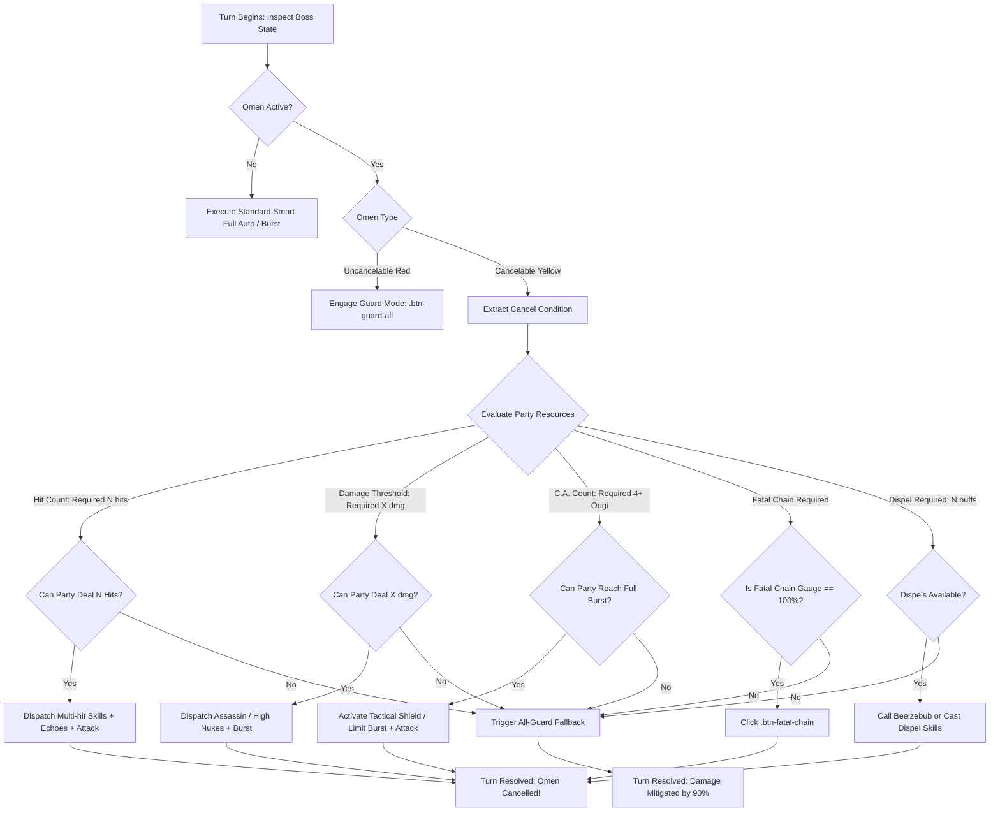

# Volume 9: Battle System 2.0 (V2) Omens, Telemetry, and Autonomous Counter Engine

## 1. Executive Summary & V1 vs V2 Architectural Paradigm

Granblue Fantasy's combat engine has evolved from the classic passive turn model (**Battle System 1.0 / V1**) to the reactive condition-solving framework known as **Battle System 2.0 (V2)**.

In V1 combat, bosses operate on charge diamonds, Overdrive/Break mode bars, and passive damage absorption. Players mitigate special attacks using universal damage cuts (e.g. Phalanx 70% + Carbuncle 30%) or delay skills.

In V2 combat, the fundamental turn loop is restructured:
1. **Mode Bars Removed**: Overdrive and Break bars are eliminated. Bosses no longer have Break states.
2. **Telegraphed Omens (予兆 / Yokou)**: Bosses broadcast upcoming special attacks, including exact cancellation criteria, turns, and targeting.
3. **Active Omen Cancellation**: Players can completely negate boss special attacks and reset charge diamonds by fulfilling specific mechanical requirements within that turn.
4. **Individual & All-Guard Mechanics**: Characters can individually forfeit offensive action to mitigate $90\%$ of incoming damage.
5. **Fatal Chain (FC)**: A shared 100-point team gauge filled by chaining Charge Attacks, functioning as a high-tier nuke and omen breaker.

```
+──────────────────────────────────────────────────────────────────────────+
│                      BATTLE SYSTEM 2.0 TURN LIFECYCLE                    │
│                                                                          │
│   1. Turn Initialization ───> Server Telemetry Transmits Active Omen    │
│                                  │                                       │
│                                  ▼                                       │
│   2. Omen Classification:                                               │
│      ├── Yellow Ring (Cancelable) ───> Parse Requirement:                │
│      │                                  - Hit count (e.g. 30 hits)       │
│      │                                  - Damage threshold (e.g. 15M)    │
│      │                                  - 4 Charge Attacks               │
│      │                                  - Dispel 2 buffs                 │
│      │                                  - Fatal Chain discharge          │
│      │                                                                   │
│      └── Red Diamond (Uncancelable) ──> Fixed Boss Script / Trigger      │
│                                  │                                       │
│                                  ▼                                       │
│   3. Autonomous Decision Engine Evaluation:                              │
│      ├── Party Can Clear? ────► Dispatch Skills/Summons ──► Attack       │
│      │                           (Omen Cancelled! Diamonds -> 0)         │
│      │                                                                   │
│      └── Party Cannot Clear? ─► Engage Guard Mode (.btn-guard-all)       │
│                                  (Incoming Damage Reduced by 90%)        │
+──────────────────────────────────────────────────────────────────────────+
```

---

## 2. Client-Server Protocols & DOM Telegraph Anatomy

### 2.1 Network Payloads & State Synchronization
Upon receiving HTTP 200 from `/rest/multiraid/start.json` or `/rest/multiraid/normal_attack_result.json`, the client inspects:
- `stage.pJsnData.is_v2`: Flag (`1` for V2, `0` for V1).
- `stage.pJsnData.boss.param[0].condition`: The active omen metadata block.
- `stage.pJsnData.boss.param[0].special_flag`: Indicates whether an uncancelable red omen is active.

### 2.2 Guard REST Protocol
When a player toggles Guard, the client dispatches:
- **Endpoint**: `POST /rest/multiraid/guard_setting.json`
- **Request Payload**:
  ```json
  {
    "special_token": null,
    "raid_id": "305191",
    "guard_status": [1, 1, 0, 1]
  }
  ```
- Where `guard_status` is a 4-element binary array corresponding to frontline party slots `0` through `3` (`1` = Guard active, `0` = Attack active).

### 2.3 Key DOM Selectors for V2 Automation
Verified against live game DOM:
- **Omen Telegraph Container**: `.prt-condition-detail, .prt-special-attack, .txt-special-attack`
- **Omen Condition Text**: `.prt-cancel-condition, .txt-cancel-condition`
- **Character Guard Button**: `.btn-guard[data-member='{index}']` (where index is `0` to `3`)
- **All-Guard Button**: `.btn-guard-all`
- **Fatal Chain Button**: `.btn-fatal-chain, .prt-fatal-chain`
- **Fatal Chain Gauge**: `.prt-fatal-chain-gauge, [data-gauge-type="fatal_chain"]`

---

## 3. Mathematical Formulation of the Guard Mechanic

### 3.1 Mitigation Formula
Unlike standard defensive buffs or weapon skill damage cuts that stack additively or multiplicatively with all-element cuts, Guard operates on an isolated base damage reduction scalar:

$$\text{Damage Received} = \text{Raw Boss Damage} \times (1 - 0.90) \times M_{\text{Defense}} \times M_{\text{Cut}}$$

Where:
- Base Guard Reduction $= \mathbf{90\%}$ ($0.10\times$ multiplier).
- $M_{\text{Defense}}$: Standard character DEF calculation ($\frac{10}{10 + \text{BuffedDEF}}$).
- $M_{\text{Cut}}$: Elemental / All-Element damage cut buffs (e.g. Phalanx).

### 3.2 Plain Damage Mitigation in V2
A unique mathematical property of Battle System 2.0:
> **In V2, Guard mitigates Plain Damage by 90%.**
> In V1, Plain Damage is strictly non-mitigatable. In V2, lethal plain damage omens (such as Wilnas's *Magma Chamber* dealing 70% Max HP, or Galleon's *Island Hurl* dealing 99,999 Plain) are reduced to 7% Max HP and ~9,999 Plain damage respectively when guarded!

### 3.3 Guard Penalties
When a character is placed in Guard mode:
1. **Zero Attack Output**: The character performs no normal attack and deals no offensive damage.
2. **Zero Charge Bar Gain**: The character gains 0% charge bar from normal attack phases.
3. **Counters Disabled**: Innate or buffed counter-attacks (dodge or damage) will not proc while guarding.

---

## 4. Fatal Chain (FC) Gauge Dynamics & Mathematics

Fatal Chain is a dedicated tactical gauge accumulating from $0\%$ to $100\%$.

### 4.1 Accumulation Formula
$$\Delta \text{FC} = (N_{\text{ougi}} \times 10\%) + B_{\text{Chain}}$$

| Charge Attacks Unleashed | Resulting Chain | Base Gain | Full Chain Bonus ($B_{\text{Chain}}$) | Total FC Gain |
| :---: | :---: | :---: | :---: | :---: |
| **1 C.A.** | Single | $10\%$ | $0\%$ | **$10\%$** |
| **2 C.A.** | 2-Chain | $20\%$ | $0\%$ | **$20\%$** |
| **3 C.A.** | 3-Chain | $30\%$ | $0\%$ | **$30\%$** |
| **4 C.A.** | 4-Chain (Full Burst) | $40\%$ | $+10\%$ | **$50\%$** |
| **5+ C.A.** | Over Burst | $50\%+$ | $+10\%$ | **$60\% - 80\%$** |

> **Operational Insight**: Two full 4-chain bursts in consecutive turns guarantee a fully charged $100\%$ Fatal Chain gauge ($\Delta \text{FC} = 50\% + 50\% = 100\%$).

### 4.2 Discharge Impact
Clicking `.btn-fatal-chain`:
- Inflicts ~**4,500,000 Plain / Superior Elemental Damage** across all enemies.
- Applies **$-20\%$ to $-30\%$ Elemental Defense Down** (special bracket).
- Satisfies omens requiring *"Activate Fatal Chain"*.

---

## 5. Authoritative V2 Raid Omens & Counter Catalog

### 5.1 Magna 3 (Omega 3) Raids
| Raid | Omen Name | Trigger | Cancel Requirement | Danger Level | Primary Counter Strategy |
| :--- | :--- | :--- | :--- | :---: | :--- |
| **Tiamat Aura** | *Aura Gale* | Full Diamonds | 10 Skill Damage instances | Medium | Manadiver crest nukes / Decimate |
| **Tiamat Aura** | *Typhoon Genesis* | 50% HP | 25 hits in 1 turn | High | Echoes + Triple Attacks + Tag Team |
| **Colossus Ira** | *Ira Flare* | Full Diamonds | 4 Charge Attacks (Full Burst) | Medium | Relic Buster Limit Burst / Kengo |
| **Colossus Ira** | *Prominence Purge* | 50% HP | 15M C.A. damage | High | Full Chain with Bahamut / Ougi specs |
| **Leviathan Mare** | *Mare Deluge* | Full Diamonds | 30 hits in 1 turn | Medium | Multi-hit skill salvo + Echoes |
| **Yggdrasil Arbos** | *Arbos Canopy* | Full Diamonds | Dispel 2 buffs | Medium | Beelzebub call / Dispel on Ougi |
| **Luminiera Credo**| *Credo Phalanx* | Full Diamonds | Land 10 debuffs in 1 turn | Medium | Miserable Mist + Multi-debuff abilities |
| **Celeste Ater** | *Ater Abyss* | Full Diamonds | Activate Fatal Chain (100% FC) | High | Discharge `.btn-fatal-chain` |

### 5.2 Six Dragons (Impossible)
| Raid | Omen Name | Trigger | Cancel Requirement | Danger Level | Primary Counter Strategy |
| :--- | :--- | :--- | :--- | :---: | :--- |
| **Wilnas** | *Magma Chamber* | 90% & 40% HP | 30 hits in 1 turn | **Wipe** | Multi-hit rotation or Guard (cuts 70% Plain) |
| **Wilnas** | *Hadron Buster* | 25% HP / Diamonds | 12M C.A. damage | High | 4-Chain Full Burst |
| **Galleon** | *Swat* | Full Diamonds | 15M damage in 1 turn | High | Full Burst or Assassin burst |
| **Galleon** | *Island Hurl* | 70% & 40% HP | Activate Fatal Chain | **Wipe** | Discharge Fatal Chain or Guard all |
| **Ewiyar** | *Mach 3* | Full Diamonds | 24 hits in 1 turn | **Wipe** | Multi-hit skills or Guard / Substitute |

### 5.3 Revans Tier Raids
| Raid | Omen Name | Trigger | Cancel Requirement | Danger Level | Primary Counter Strategy |
| :--- | :--- | :--- | :--- | :---: | :--- |
| **Diaspora** | *Emergency Repair*| Phase 1 (Gauge 100) | 97 hits in 1 turn | High | Full party multi-hit salvo to enter Phase 2 |
| **Siegfried** | *Uwe* | Turn 4, 8, 12... | Use 3 Debuff skills | High | Reserve and cast 3 debuffs concurrently |
| **Siete** | *Infinito Cremona*| Full Diamonds | 6 Charge Attacks | **Wipe** | Kengo dual-ougi burst or All-Guard |
| **Cosmos** | *Balance Deviation*| Gauge skewed | 30 hits (Red) / 4 C.A. (Blue) | High | Balance hit rate vs charge attack rate |

### 5.4 Apex Endgame (SUBHL, Tengen, Lucilius Zero)
| Raid | Omen Name | Trigger | Cancel Requirement | Danger Level | Primary Counter Strategy |
| :--- | :--- | :--- | :--- | :---: | :--- |
| **SUBHL** | *Ten Thousand Paths*| 100% - 75% HP | 20M Elemental damage | High | Assigned element bursts 20M damage |
| **SUBHL** | *Crisis Crunch* | 50% - 10% Diamonds | 20M damage or 60 hits | High | High-multiplier burst or Guard all |
| **SUBHL** | *Genesis Nova* | 10% HP Trigger | **Uncancelable Red** | **Wipe** | 999,999 Plain; survive via Guts/Sacrifice |
| **Tengen** | *Crucible Omens* | 100% - 40% HP | 2M x 6 hits / 36 hits / 4 C.A. | **Wipe** | Strict condition triage by elemental pair |
| **Faa0** | *Twelve Labors* | 60% & 20% HP | 60 hits / 40M dmg / 5 C.A. | **Wipe** | Must cancel to preserve End Gauge |

---

## 6. Algorithmic Counter Engine & Autonomous Decision Logic

The automated combat engine (`CombatActionService` / `HostedCombatRunner`) executes the following decision pipeline when an omen is detected:



---

## 7. Machine-Readable Integration

- **`data/combat/omens.catalog.json`**: Authoritative JSON catalog with explicit triggers, required counts, and counter actions.
- **`data/combat/v2-counter-taxonomy.json`**: Decision matrix and resource solver mappings for each condition type.
- **`src/domain/data/data-catalog.service.ts`**: TypeScript singleton providing instant $O(1)$ lookup for raid omens and counter strategies.
