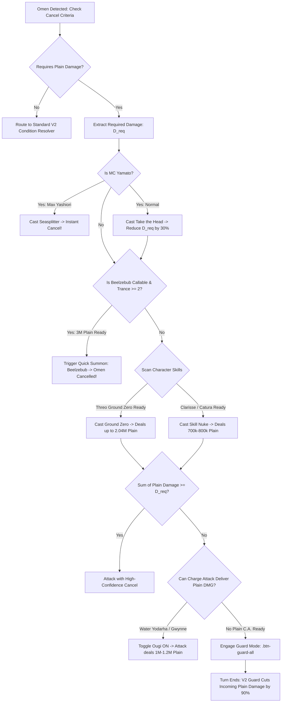

# Volume 10: Plain Damage Mechanics, Sources Catalog, and Autonomous V2 Counter Engine

## 1. Executive Summary & Physics of Plain Damage

In Granblue Fantasy (GBF), **Plain Damage (無属性ダメージ - *Musokusei Damēji*)** occupies a unique position in the combat architecture. Unlike elemental damage, which is filtered through elemental advantage brackets ($M_{\text{Elemental}}$), weapon skill multipliers (Normal, Magna, EX), boss defense ratings ($M_{\text{Def}}$), and damage cuts, Plain Damage functions as **true, defense-piercing damage**.

### 1.1 Fundamental Physical Properties
1. **Ignores Enemy Defense**: Whether a boss has 10 DEF or 999,999 DEF (e.g. Gold Slimes, Sephira Guardians, high-difficulty bosses), Plain Damage deals its exact mathematically calculated value.
2. **Ignores Elemental Resistance & Cuts**: Plain damage bypasses All-Elemental Damage Cuts (e.g. Phalanx 70%), elemental cuts (Carbuncles), and the modern **Off-Element Resistance (非有利属性耐性)** penalty.
3. **Incapable of Critical Strikes**: Plain attacks are mathematically locked to a 0% critical hit rate.
4. **Isolated from Grid Damage Caps**: Standard weapon grid Damage Cap Up skills and Seraphic weapon blessings ($M_{\text{Seraphic}}$) do **not** amplify Plain Damage. Each plain damage ability or summon call operates under its own hard-coded internal cap.
5. **Mitigation in Battle System 2.0 (V2)**:
   * In V1, Plain Damage is non-mitigatable.
   * **In V2, the Guard mechanic reduces incoming Plain Damage by 90%**. A lethal 70% Max HP attack becomes 7% Max HP, and 99,999 Plain damage becomes 9,999 Plain damage when guarded.

---

## 2. Mathematical Formulations & Scaling Taxonomy

Plain damage sources in GBF follow five distinct mathematical formulas:

### 2.1 Consumed-HP Scaling (Threo / Disparia)
$$D_{\text{Plain}} = \min\left( \text{Cap}, \text{HP}_{\text{Consumed}} \times K_{\text{Multiplier}} \right)$$

* **Threo (Sarasa) - Ground Zero**:
  * Consumes $99\%$ of current HP.
  * Base Cap: $\sim 820,000$
  * Level 95 Cap: $\sim 1,230,000$
  * Level 130 Transcendence Cap: $\sim \mathbf{2,040,000}$
* **Sword Master / Glorybringer - Disparia (Mainhand)**:
  * Consumes $30\%$ of current HP.
  * Deals $30\times$ (base) or $45\times$ (4★) current HP as plain damage to all foes (Cap: $\sim 820,000 - 1,200,000$).

### 2.2 Fixed-Stack Scaling (Water Yodarha / Pengy)
$$D_{\text{Plain}} = S_{\text{Stacks}} \times D_{\text{PerStack}}$$

* **Yodarha (SSR Water) - Ultimate Flash**:
  * Consumes up to 3 *Triple Shroud* stacks on Charge Attack.
  * Formula: $3 \times 333,333 = \mathbf{999,999}$ flat plain damage.

### 2.3 Flat Multi-Hit Scaling (Gwynne)
$$D_{\text{Plain}} = N_{\text{Hits}}(\text{HP\%}) \times D_{\text{HitCap}}$$

* **Gwynne - Lunatic Lashings (Charge Attack)**:
  * $\text{HP} \ge 76\% \implies 3 \times 400,000 = \mathbf{1,200,000}$ plain damage.
  * $51\% \le \text{HP} \le 75\% \implies 2 \times 400,000 = 800,000$ plain damage.
  * $\text{HP} \le 50\% \implies 1 \times 400,000 = 400,000$ plain damage.

### 2.4 Target Current-HP Percentage Scaling (Clarisse / Michael)
$$D_{\text{Plain}} = \min\left( \text{Cap}, \text{BossCurrentHP} \times P_{\text{Percent}} \right)$$

* **Clarisse (Fire / Light) - Atomic Resolution**:
  * Deals $1\%$ to $5\%$ of boss current HP up to a hard cap of $\sim \mathbf{710,000}$ plain damage.
* **Michael (4★ Summon) - Ignis Iudicium**:
  * Deals up to $\mathbf{1,500,000}$ plain damage based on enemy current HP + Delay + Dispel.

### 2.5 Fixed Summon Nuke (Beelzebub)
$$D_{\text{Plain}} = \mathbf{3,000,000} \quad (\text{Trance Level} \ge 2)$$

* When Beelzebub is summoned with MC Trance Lv 2 or 3, it delivers an unconditional flat $3\text{M}$ plain damage nuke, 3 dispels, and $-50\%$ defense reduction.

---

## 3. Exhaustive Catalog of Plain Damage Sources

### 3.1 High-Impact Summons
| Summon | Call Name | Plain Damage Cap | Scaling / Condition | Additional Tactical Utility |
| :--- | :--- | :---: | :--- | :--- |
| **Beelzebub (4★)** | *Chaos Void* | **3,000,000** | Fixed (Trance Lv $\ge 2$) | 3 Dispels, -40% DEF, Borehole (-50% DEF + 100k supp) |
| **Belial (4★)** | *Parade's Lust* | **3,000,000** | Random Roll | Sub-aura: +30k supplemental damage to all hits |
| **Michael (4★)** | *Ignis Iudicium*| **1,500,000** | Boss HP Percentage | Inflicts Delay + Dispels 1 buff |
| **The Tower (5★)** | *Tower of Destruction*| **1,000,000** | Turn-end tick (3 turns) | Passive DEF & HP sub-aura for Earth |
| **Grand Order (5★)**| *Peacemaker's Judgment*| **1,000,000** | Fixed | Team Drain (healing on hit) + ATK buff |

### 3.2 Characters by Element
| Element | Character | Ability / Mechanism | Max Plain DMG | Cooldown | Special Synergy |
| :--- | :--- | :--- | :---: | :---: | :--- |
| **Earth** | **Threo (Sarasa)** | *Ground Zero* (Skill 3) | **2,040,000** | 6 turns | Consumes 99% HP; 100% Shield; Jammed |
| **Earth** | **Pengy** | *P-Engy Full Blast* | **999,999** | 7 turns | Self-KO nuke; switches in backline Evoker |
| **Water** | **Yodarha (SSR)** | *Ultimate Flash* (C.A.) | **999,999** | 0 turns | 3 Shroud stacks; flat 999k on Turn 1 |
| **Water** | **Gwynne** | *Lunatic Lashings* (C.A.) | **1,200,000** | 0 turns | 3 hits of 400k plain damage at $\ge 76\%$ HP |
| **Water** | **Kolulu (Summer)**| *Sun-Drenched Tallyho*| **700,000** | Auto | Auto-proc when HP is in the red ($<25\%$) |
| **Fire** | **Clarisse** | *Atomic Resolution* | **710,000** | 6 turns | Deals 1%-5% HP plain + Dispels 1 buff |
| **Wind** | **Catura** | *Moo-Licious* (Skill 1) | **800,000** | 6 turns | Consumes charge bar; team multi-attack buff |
| **Wind** | **Yodarha (Wind)** | *Twin Flash* (Skill 1) | **600,000** | 5 turns | Perpetual Flash consumption |
| **Light** | **Clarisse (Light)**| *Atomic Resolution II* | **710,000** | 6 turns | Deals plain damage + Dispel + Team Supplemental |
| **Light** | **Horus** | *Eye of the Sun* (Skill 3) | **500,000** | 6 turns | Deals plain damage, gives C.A. bar, inflicts Blind |
| **Dark** | **Lunalu (SSR)** | *Facsimile II* (Skill 1) | **2,040,000** | 6 turns | **100% copies Ground Zero for 4.08M total plain!** |
| **Dark** | **Black Knight** | *Acumen* (Skill 3) | **500,000** | 5 turns | Deals 500k plain damage + Delay |

### 3.3 Main Character (MC) Classes & Specialized Weapons
1. **Yamato (Row V Class)**:
   * *Take the Head*: Reduces any active cancelable Omen's requirement by **20% to 30%** (e.g. reduces 2M plain requirement down to 1.4M).
   * *Seasplitter*: **Instantly cancels any cancelable omen regardless of condition** (bypasses plain damage requirement entirely).
2. **Sword Master / Glorybringer (with Disparia Mainhand)**:
   * Skill 1 (*Awaken*): Consumes 30% HP to deal $30\times$ to $45\times$ current HP as plain damage ($\mathbf{800k - 1.2M}$ team-wide).
3. **Tormentor (with Secret Gear)**:
   * *Well-Worn Blade* / *Toxic Spike*: Craftable gears dealing on-demand Plain damage without skill cooldown restrictions.

---

## 4. Battle System 2.0 (V2) Plain Damage Omens & Trials

| Raid | Omen / Trial | Requirement | Consequence of Failure | Optimal Solver Sequence |
| :--- | :--- | :--- | :--- | :--- |
| **Lucilius HL (FaaHL)** | *Labor VII (Trial 7)* | **Deal 2,000,000 Plain DMG** | Lucilius attacks pierce with Dark Elemental DMG permanently | **Call Beelzebub (3M)** or **Threo Ground Zero (2.04M)** |
| **Siete (Revans)** | *Carro Magnifico (10%)* | **Incoming 77,777 Plain DMG** | Wipes any character with $<77,778$ HP | **Guard all (.btn-guard-all cuts to ~7,777)** or **Titan** |
| **SUBHL** | *Genesis Nova (10%)* | **Incoming 999,999 Plain DMG** | Inflicts permanent Death Ineluctable (No Revive) | **10% Execution burst** or **Sacrificial unit swap** |
| **Wilnas (Impossible)** | *Magma Chamber* | **Incoming 70% Max HP Plain** | Collapsed + Burn + 200% Charge Cut | **Guard all (.btn-guard-all cuts to 7% Max HP)** |
| **Galleon (Impossible)**| *Island Hurl* | **Incoming 99,999 Plain DMG** | Party Wipe | **Discharge Fatal Chain** or **Guard all (cuts to 9,999)** |

---

## 5. Autonomous Decision Pipeline & Execution Engine

---

## 6. Programmatic Integration

* **`data/combat/plain-damage.catalog.json`**: Authoritative data catalog of all plain damage sources, scaling types, caps, and cooldowns.
* **`data/combat/plain-damage-counter-engine.json`**: Machine-readable solver pipeline and mitigation rules.
* **`src/domain/data/data-catalog.service.ts`**: TypeScript methods `getPlainDamageSources()`, `getPlainDamageSummons()`, and `solvePlainDamageOmen()`.
