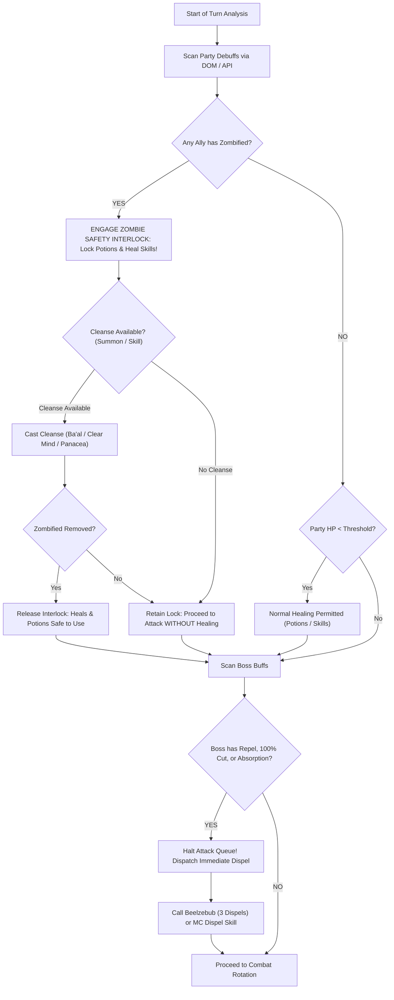

# Granblue Fantasy Technical Knowledge Base: Volume 11
## Status Effects, Dispel & Cleanse Taxonomy, and Autonomous Survival KMS

### Abstract
This technical volume establishes the authoritative knowledge management architecture and autonomous decision engine for status effects in Granblue Fantasy (GBF). In high-difficulty raids (such as PBHL, Akasha, GOHL, Magna 3, Six Dragons, and Revans), boss buffs (e.g. 100% Damage Cut, Repel, Elemental Absorption) and debilitating party debuffs (e.g. Zombified, Paralysis, Skill Seal) dictate combat survival. This document formalizes status effect taxonomies, priority scoring matrices, dispel/cleanse asset registries, and the **Zombified Safety Interlock** for headless autonomous agents.

---

## 1. Status Effects Physics & Threat Taxonomies

### 1.1 Boss Buffs & Dispel Threat Hierarchy
Boss buffs directly impede damage output or pose lethal threats to attacking party members.

| Threat Tier | Buff Type | Removable | Tactical Risk | Dispel Priority |
| :--- | :--- | :--- | :--- | :--- |
| **Wipe** | **Repel (Damage Reflection)** | Yes | Reflects high-potency damage back to party; attacking into Repel results in team suicide. | `immediate` |
| **Wipe** | **Elemental Absorption** | Yes | Converts all incoming elemental damage into boss HP recovery; attacks heal the boss to full. | `immediate` |
| **High** | **100% Damage Cut** | Yes | Nullifies all incoming elemental damage; wasted burst turns. | `immediate` |
| **High** | **Tri-Slash / Multi-Strike** | Yes | Boss strikes 3 to 4 times per turn; shreds frontline tanks within 1-2 turns. | `high` |
| **High** | **Uplift (Charge Boost)** | Yes | Generates +1 to +2 extra charge diamonds per turn, accelerating fatal omens. | `high` |
| **Medium**| **50% DEF Up** | Yes | Reduces party damage by 33%–50%, jeopardizing omen cancel damage thresholds. | `high` |
| **Medium**| **Mirror Image** | Yes | Nullifies single-target normal attacks; strips via AoE skill or dispel. | `high` |
| **Low** | **ATK / DATA Up** | Yes | Standard offensive buff; manageable via damage cuts and defensive buffs. | `normal` |
| **Ignore**| **Transcendent / Golden Border**| **No** | **消去不可**: Immune to dispel. Dispel skills MUST NOT be cast on unremovable buffs. | `ignore` |

### 1.2 Party Debuffs & Cleanse Threat Hierarchy
Debuffs inflicted on party members compromise action availability, action effectiveness, and survival.

| Threat Tier | Debuff Type | Cleanseable | Veil Blockable | Tactical Risk & Safety Rule | Cleanse Priority |
| :--- | :--- | :--- | :--- | :--- | :--- |
| **Wipe** | **Zombified (Undead)** | Yes | Yes | **LETHAL SAFETY INTERLOCK**: Inverts all healing into True Plain Damage. Using potions or heals causes instant party suicide. | `immediate` |
| **Wipe** | **Paralysis / Stun** | Yes | Yes | Allies cannot act, attack, cast skills, or guard. Cleanse immediately. | `immediate` |
| **Wipe** | **Skill Seal** | Yes | Yes | Locks all skills across all cooldowns. Requires summon or auto-cleanse. | `immediate` |
| **High** | **Petrified** | Yes | Yes | Freezes charge bar at 0%; blocks charge attacks and Fatal Chain formation. | `high` |
| **High** | **C.A. Seal** | Yes | Yes | Blocks Charge Attack activation even at 100% bar; blocks V2 ougi omens. | `high` |
| **High** | **Strong Poison / Putrefy**| Yes | Yes | End-of-turn damage burns 15%–25% max HP per turn. | `high` |
| **Medium**| **Charm / Confuse** | Yes | Yes | High probability of allies skipping turns or damaging teammates. | `normal` |
| **Medium**| **DEF Down / Fragile** | Yes | Yes | Lowers party defense, making bosses hit for lethal numbers. | `normal` |

---

## 2. Dispel & Cleanse Asset Catalog

### 2.1 Top-Tier Dispel Assets
```text
Summons:
├── Beelzebub 4★   : 3 Dispels instantly on call (Priority Score: 100)
├── Michael 4★     : 1 Dispel + Delay on all foes (Priority Score: 90)
├── Lucifer 250    : 1 Dispel + 3,000 HP heal on call (Priority Score: 88)
├── Yatagarasu 4★  : 2 Dispels to all foes on call (Priority Score: 85)
└── Metatron 4★    : 1 Dispel + Dark ATK Down / Light DEF Down (Priority Score: 80)

Main Character (MC):
├── Dispel (Sorcerer Sub-Skill)       : 1 Target Dispel, 5-turn CD
├── Manadiver (Leviathan Minit)       : Passive Auto-Dispel whenever foe casts special move
├── Iatromantis (Megas Stethos)       : 2 AoE Dispels + Gravity, 6-turn CD
└── Kengo (Unsigned Kaneshige)        : Dispel on Charge Attack

Characters:
├── Fire : Clarisse (Atomic Resolution), Grand Percival, Summer Mirin
├── Water: Haaselia (5★ FLB), Cassius (Event/Valentine), Summer Kolulu
├── Earth: Lobelia, Caim, Pengy
├── Wind : Grimnir (Valentine), Vira, Catura
├── Light: Clarisse (Light), Horus (Ougi Dispel), Hal&Mal
└── Dark : Lich (End-of-turn Auto-Dispel), Fediel, Black Knight
```

### 2.2 Top-Tier Cleanse & Veil Assets
```text
Main Character (MC):
├── Clear Mind (Bishop Sub-Skill)     : Cleanses 1 debuff from all allies (3-turn CD)
├── Panacea (Sanatio Melior)          : Cleanses 2 debuffs + massive party HP heal
└── Doctor (Nutrient + Vaccine)       : Grants 1-time Debuff Immunity (Veil) + Refresh

Summons:
├── Ba'al 4★                          : Cleanses 1 debuff on call
├── Lucifer 250                       : Restores HP + cleanses on call
└── Apollo 4★                         : Grants party Veil on call

Characters:
├── Katalina (Grand) [Water]          : 1-Button Veil + 25% Damage Cut
├── Tikoh [Light]                     : Auto-cleanses 1 debuff & heals at end of EVERY turn
├── Kokkoro [Wind]                    : Charge attack heals & cleanses 1 debuff
└── Mahira [Earth]                    : Grants party Veil + debuff cleansing
```

---

## 3. The Zombified Safety Interlock & Decision Pipeline

### 3.1 Zombified Hazard & Interlock Logic
When the party is afflicted with **Zombified (アンデッド)**, the healing formula inverts:

$$\text{HP Net Change} = -1 \times \text{Healing Potency}$$

A single **All-Potion** (restoring 100% Max HP) will instantly wipe all frontline combatants from 100% to 0 HP.



---

## 4. Integration with Autonomous KMS Engine
The status effects data catalog is mapped directly into `data/combat/status-effects.catalog.json` and exposed through `DataCatalogService.getStatusEffectsCatalog()`, providing O(1) indexed lookups for:
1. `isDebuffIncompatible(action, activeDebuffs)`: Prevents fatal self-inflicted wipes.
2. `getImmediateDispelQueue(bossBuffs)`: Automatically orders dispels by priority score.
3. `getSafeHealingEligibility(partyDebuffs)`: Guarantees 100% adherence to safety interlocks.
