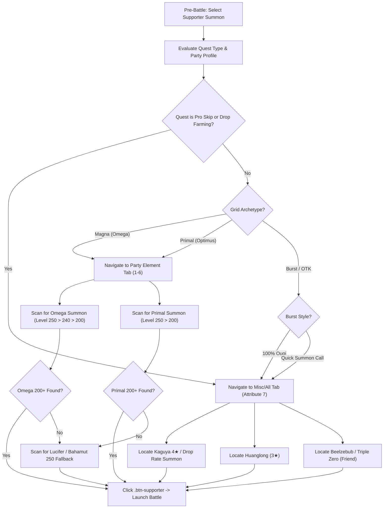

# Granblue Fantasy Technical Knowledge Base: Volume 12
## Supporter Summon Taxonomy, Grid Archetypes & Autonomous Selection Engine

### Abstract
This technical volume establishes the authoritative knowledge management architecture and algorithmic decision engine for Granblue Fantasy Supporter Summon selection. Supporter summons provide up to 170% weapon skill amplification, +150% elemental attack, instant 100% ougi gauge, or +25% drop rate bonuses. Selecting an incompatible supporter summon (e.g., choosing an Omega summon for an Optimus grid, or choosing a non-Friend summon with call delays for an OTK raid) diminishes damage output by over 60% or breaks raid execution pipelines. This document formalizes grid-to-summon mappings, attribute tab routing, uncap tier scoring, and the pre-battle selection decision matrix.

---

## 1. Grid Archetypes & Weapon Skill Multipliers

In Granblue Fantasy, weapon skill damage formulas depend directly on the primary summon aura:

$$\text{Total Skill Mod} = 1 + (\text{Skill Base}) \times (1 + \text{Main Aura} + \text{Friend Aura})$$

```text
Grid Archetype Taxonomy:
├── 1. Magna / Omega (方陣)
│   ├── Weapon Skills : Omega / Magna (方陣攻刃, 方陣神威, 方陣刹那)
│   ├── Matching Aura : Omega Summon (Colossus, Leviathan, Yggdrasil, Tiamat, Luminiera, Celeste)
│   └── Multipliers   : 4★ = 120% | 5★ = 140% | 6★ Lv 250 (Transcendence) = 170%
│
├── 2. Optimus / Primal (神石)
│   ├── Weapon Skills : Normal / Primal (通常攻刃, 通常神威, 刹那, 技巧)
│   ├── Matching Aura : Primal Summon (Agni, Varuna, Titan, Zephyrus, Zeus, Hades)
│   └── Multipliers   : 4★ = 140% | 5★ = 150% | 6★ Lv 250 (Transcendence) = 170%
│
├── 3. Elemental / Rainbow
│   ├── Weapon Skills : Applicable across all mixed / general grids
│   ├── Matching Aura : Flat Elemental ATK (Lucifer 250, Bahamut 250, Shiva, Europa, Grimnir)
│   └── Multipliers   : 140% – 150% Flat Elemental ATK
│
├── 4. Burst / One-Turn-Kill (OTK)
│   ├── Mechanics     : Instant Turn 1 mechanics (Huanglong 100% C.A., Beelzebub 3M Plain DMG)
│   └── Primary Use   : Guild Wars Meat Farming, Magna 3 Rapid Leeching, Event Token Grinding
│
└── 5. Farming / Drop Rate Boost
    ├── Mechanics     : Increases Item Drop Rate (+25%) and EXP (+30%)
    └── Primary Use   : Daily Pro Skips, Angel Halo, Campaign Quests, Scenario Event Box Farming
```

---

## 2. Attribute Tab Routing & Supporter Indices

Granblue Fantasy separates supporter summons into seven distinct tabs on the `#quest/supporter` interface:

| Tab Attribute ID | Element | Supporter Series | Primary Summon Names |
| :---: | :---: | :---: | :---: |
| **1** | **Fire (火)** | Omega / Primal / Elemental | Colossus Omega (250), Agni (250), Shiva, Michael |
| **2** | **Water (水)** | Omega / Primal / Elemental | Leviathan Omega (250), Varuna (250), Europa, Gabriel |
| **3** | **Earth (土)** | Omega / Primal / Elemental | Yggdrasil Omega (250), Titan (250), Uriel, Gorilla |
| **4** | **Wind (風)** | Omega / Primal / Elemental | Tiamat Omega (250), Zephyrus (250), Grimnir, Raphael |
| **5** | **Light (光)** | Omega / Primal / Elemental | Luminiera Omega (250), Zeus (250), Lucifer (250), Metatron |
| **6** | **Dark (闇)** | Omega / Primal / Elemental | Celeste Omega (250), Hades (250), Bahamut (250), Sariel |
| **7** | **Misc / All (フリー)** | Farming / Burst / Utility | **Kaguya 4★**, **Beelzebub 4★**, **Triple Zero 4★**, **Huanglong**, **Qilin** |

---

## 3. Uncap Tier Priority Scoring

When multiple supporters matching the target name appear in the supporter list, the decision engine selects the highest uncap level to maximize aura potency:

| Uncap Tier | Level Range | Star Rating | Priority Score | Tactical Benefit |
| :--- | :---: | :---: | :---: | :--- |
| **Transcendence Stage 5** | Lv 250 | 6★ (Blue Gem) | **100** | Maximum 170% aura boost + upgraded call effects + Sub-aura active. |
| **Transcendence Stage 1-4**| Lv 210–240 | 6★ | **90** | 150%–160% aura boost + upgraded stats. |
| **Final Limit Break (FLB)**| Lv 200 | 5★ | **80** | Standard 140%–150% aura boost. |
| **Maximum Limit Break (MLB)**| Lv 100–150 | 4★ | **60** | Base uncap; sub-optimal aura potency. |
| **Base / Low Uncap** | Lv 40–80 | 0★–3★ | **30** | Emergency fallback only. |

### Friend vs. Non-Friend Call Mechanics
- **Friend Summon**: Can be called on **Turn 1** immediately (unless summon explicitly has a fixed startup cooldown).
- **Non-Friend Summon**: Imposes a **1 to 3 turn call lockout** at the start of battle.
- **Rule for Burst / Leech Farming**: The KMS engine enforces `preferFriend: true` for any raid where a Turn 1 summon call (e.g., Beelzebub or Triple Zero) is integral to the OTK sequence.

---

## 4. Algorithmic Supporter Selection Pipeline



---

## 5. Implementation Architecture
The supporter catalog is codified in `data/combat/supporter-summons.catalog.json` and consumed via `DataCatalogService.getSupporterSelectionRules()`. The `SupporterSelectionService` automates:
1. Converting element name to numeric tab index (`getSupporterTabForElement(element)`).
2. Applying regex pattern matching on DOM `.prt-supporter-detail` elements.
3. Scoring candidates by Level / Star rating and dispatching the optimal click.
