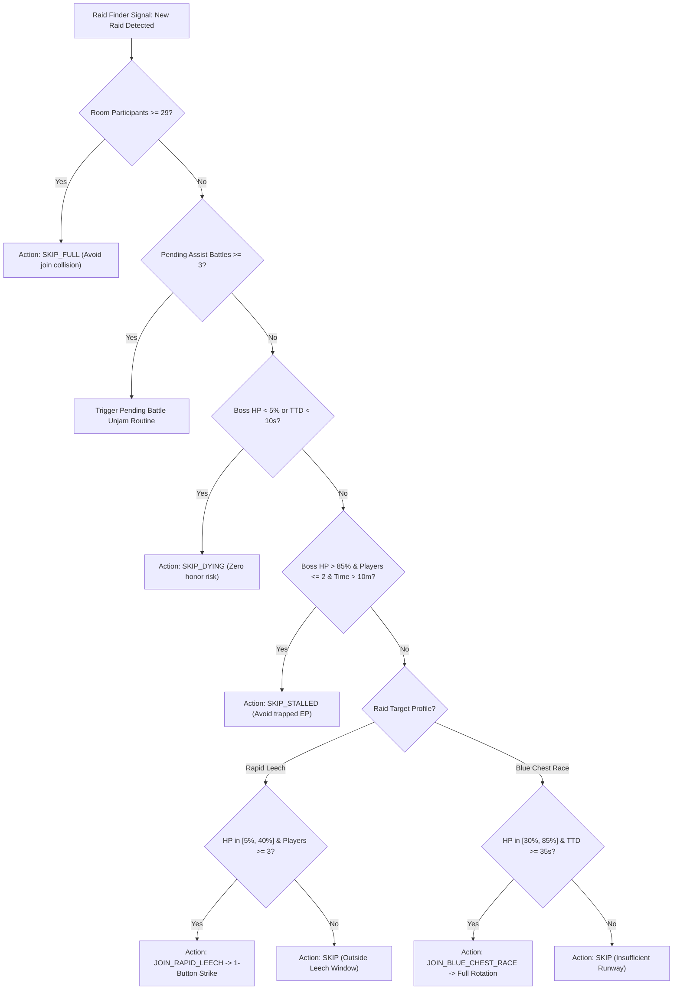

# Granblue Fantasy Technical Knowledge Base: Volume 13
## Raid Evaluation, Leech vs. Racing Heuristics & EP Economy KMS

### Abstract
This technical volume formalizes the knowledge management system and decision-making heuristics for autonomous raid assistance and Raid Finder participation. In Granblue Fantasy, spending Soul Berries (EP) to enter backup raids carries severe opportunity costs. Joining a dying raid ($< 5\%$ HP) often results in the boss perishing before a turn resolves, wasting EP and locking one of the player's 3 concurrent pending assist slots. Conversely, joining a stalled room ($> 85\%$ HP with 1 inactive player) traps EP for hours. This document provides mathematical models for Time-to-Death ($TTD$), honor velocity, drop Return-on-Investment ($ROI_{EP}$), and the autonomous raid evaluation pipeline.

---

## 1. The Economics of Raid Participation

### 1.1 Concurrency Limits & Opportunity Cost
- **3-Assist Limit**: A player can actively assist in a maximum of **3 concurrent battles** at any given moment.
- **5-Unclaimed Battle Limit**: If a player has **5 battles** pending loot collection, the game server throws `403 /assist_failed` and blocks joining any new raid until pending battles are settled.
- **EP Costs**: High Level raids cost **3 EP** (or **5 EP** un-discounted). Soul Berries are a finite economy; automated joining must maximize drop utility per EP spent.

### 1.2 Return on Investment ($ROI_{EP}$) Formula
The expected value ($EV$) of joining a raid is given by:

$$EV_{\text{raid}} = P_{\text{blue}}(H) \times V_{\text{blue}} + P_{\text{gold}}(H) \times V_{\text{gold}} + V_{\text{clear}} - C_{\text{EP}}$$

Where:
- $H$: Expected honors accumulated by the player before boss dies.
- $P_{\text{blue}}(H)$: Probability of obtaining a Blue Chest at $H$ honors (e.g., $100\%$ at 1.48M honors in PBHL).
- $V_{\text{blue}}$: Value weight of the Blue Chest (Gold Bar at 1.5% in PBHL, 1.2% in Akasha/GOHL).
- $C_{\text{EP}}$: EP resource cost (typically 3 or 5).

---

## 2. Dynamic Room Velocity & Time-to-Death ($TTD$)

### 2.1 Velocity Physics
The raid's remaining lifespan is governed by the aggregate damage output of all participants:

$$\text{Room DPS} \approx \frac{\Delta \text{Boss HP}}{\Delta t} \approx \sum_{i=1}^{N_{\text{active}}} \text{DPS}_i$$

$$\text{Estimated Time-to-Death } (TTD) = \frac{\text{Current Boss HP}}{\text{Room DPS}}$$

### 2.2 Player Honor Runway
A player with an average burst rate of $\text{DPS}_{\text{player}}$ can realistically accumulate:

$$\text{Runway Honors} = \min\left(\text{Player Burst Cap}, TTD \times \text{DPS}_{\text{player}}\right)$$

If $\text{Runway Honors} < \text{Blue Chest Threshold}$, attempting a Blue Chest race is statistically non-viable and results in wasted EP.

---

## 3. Action Policy Taxonomy

| Policy Name | HP Window | Participant Window | Tactical Action | Primary Target Raids |
| :--- | :---: | :---: | :--- | :--- |
| **`SKIP_DYING`** | $0\% - 5\%$ | Any | **ABORT JOIN**: Boss will die before the attack packet resolves. | All Raids |
| **`RAPID_LEECH`** | $5\% - 35\%$ | $3 - 27$ | **1-TURN BURST / QUICK SUMMON**: Fire 1 burst or call summon, claim completion chest. | Magna 3, Six Dragons, Lindwurm |
| **`BLUE_CHEST_RACE`** | $30\% - 85\%$ | $1 - 16$ | **FULL RACING ROTATION**: Push 1.48M–1.56M honors for guaranteed Blue Chest. | PBHL, Akasha, GOHL |
| **`SKIP_STALLED`** | $85\% - 100\%$ | $1 - 2$ (Time $> 10$m) | **ABORT JOIN**: Stalled room with inactive host; high risk of raid failure. | High Level & Revans |
| **`SKIP_FULL`** | Any | $29 - 30$ | **ABORT JOIN**: Server will reject HTTP join handshake due to max concurrency. | All Raids |

---

## 4. Raid Join Decision Pipeline

---

## 5. Architectural Integration
The raid evaluation taxonomy is codified in `data/raids/raid-join-decision.json` and consumed by the `RaidEvaluator` service and `OTKRaidEvaluator`. The evaluation pipeline ensures that every assist request executed by the remote controller yields maximal drop utility, zero trapped pending slots, and 100% adherence to EP efficiency standards.
