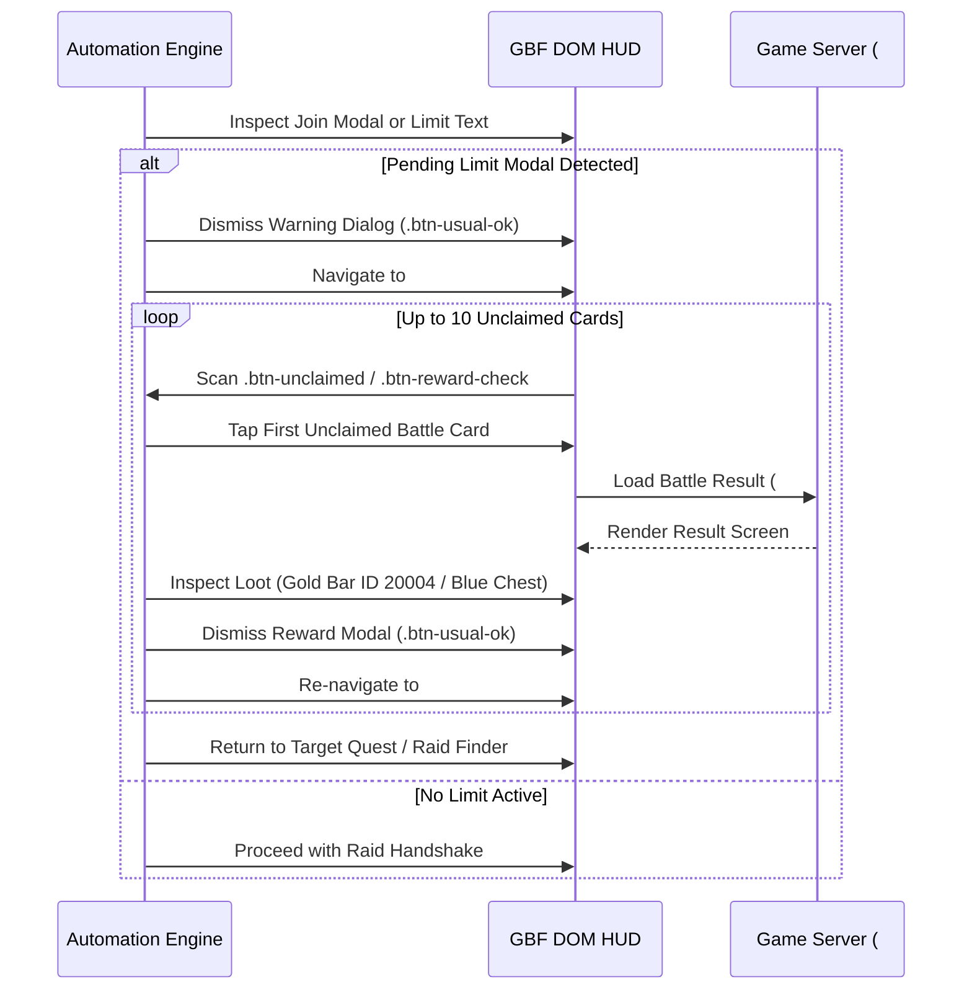
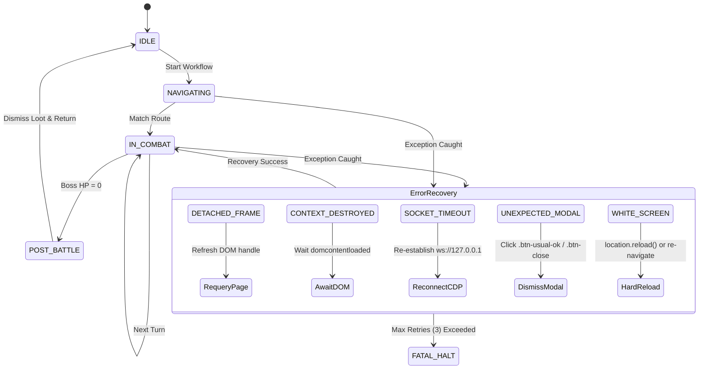

# Volume 14: Automation Engine Architecture & Operational Resilience KMS

**Version:** 2.0.0  
**Author:** Senior Distributed Systems & Knowledge Architecture Principal  
**Target Repository:** `C:\laragon\www\gbf\data\automation\`  
**Compliance:** JSON Schema Draft 2020-12, Zero Duplication Policy, SOLID Enterprise Architecture  

---

## 1. Executive Summary & Purpose

Granblue Fantasy (GBF) automation systems operate within a challenging intersection: a high-frequency, client-heavy single-page application (Backbone.js + Zepto.js + CreateJS) interacting with distributed server clusters enforcing strict rate limits, anti-cheat heuristics, and session boundaries.

Historically, automation rules, timing budgets, recovery handlers, and anti-detection parameters were scattered across imperative TypeScript code, ad-hoc CLI flags, and script configurations. This Volume formalizes the **Automation Domain Knowledge Management System (KMS)**, establishing a version-controlled, declarative, schema-validated Single Source of Truth (SSOT) located in `data/automation/`.

### The Core Automation Knowledge Domains:
```
                                 data/automation/
 ┌───────────────────────────────────────┼───────────────────────────────────────┐
 │                                       │                                       │
 ▼                                       ▼                                       ▼
1. Resource Recovery Policies       2. Reload & Lockout Profiles            3. Event Automation
   - AP / EP / AAP Replenishment       - Turbo, Fast, Normal, Stealth          - Scenario Story Clears
   - 3-Raid / 5-Battle Unjamming       - CreateJS Ticker & Tween Override      - Senka Drawbox Optimization
   - Token & Item Inventory Limits     - Turn Processing Recovery              - Nightmare (HELL) 10x Skip
 │                                       │                                       │
 ├───────────────────────────────────────┼───────────────────────────────────────┤
 │                                       │                                       │
 ▼                                       ▼                                       ▼
4. Cooldowns & Pacing Budgets       5. Multi-Account Orchestration          6. State Machine Recovery
   - 180s Pub Backup Broadcast         - CDP Port Allocations & Topologies     - Error Taxonomy & Self-Healing
   - Raid Finder 1.5s Rate Limit       - Staggered Launch Delays               - Transition Fallbacks
   - Micro/Macro Rest Schedules        - Headless vs Windowed Sync             - Session & Frame Re-binding
 │                                       │                                       │
 └───────────────────────────────────────┴───────────────────────────────────────┘
                                         ▼
                            7. Sentinel Watchdog & Security
                               - 30+ CAPTCHA Selectors & Network Traps
                               - Anomaly Streaks & Emergency Halt
                               - Human-in-the-Loop Webhook Protocols
```

---

## 2. Resource Recovery & Session Resilience

Automated farming engines (Gold Bar hunters, Daily Host routines, Event loopers) consume massive quantities of Action Points (AP) and Battle Points (EP), while frequently encountering multiplayer session locks.

### 2.1 Replenishment Economics & Thresholds
- **Half-Elixir (Item ID `1`)**: Restores 50 AP (or 75 AP during 1.5x AP Magnafest campaigns). Automation triggers recovery when `currentAP < questAPCost`.
- **Full Elixir (Item ID `2`)**: Restores 100% maximum AP. Reserved exclusively for emergencies or configured overrides.
- **Soul Berry (Item ID `5`)**: Restores 1 EP. Primary consumable for raid leeching (1–3 EP per join).
- **Soul Balm (Item ID `6`)**: Restores 5 EP. Bulk consumption item.
- **AAP (Arcarum Action Points)**: Consumed in Replicard Sandbox (Here Be Swords / Staves). Restored via Sephira AAP elixirs.

### 2.2 The 3-Raid Assist Limit & Unclaimed Loot Jam
GBF client-server architecture enforces two hard concurrency limits on multiplayer assist participation:
1. **Active Battle Limit**: A player can participate in at most **3 active multiplayer raids** concurrently.
2. **Pending Unclaimed Loot Limit**: When **5 battles** have concluded with unclaimed loot, all further raid joins are locked by the server with a modal warning:
   > *"You cannot join any more raids until you check the results of your previous battles."* (`未確認のバトルがあります`)

#### The Autonomous Unjamming Algorithm:


---

## 3. High-Performance Battle Reload & CreateJS Acceleration

In high-intensity raid farming (Proto Bahamut HL, Akasha, Grand Order HL), honors racing is determined by **Turn Cycle Velocity**. Watching combat animations costs 8–15 seconds per turn, whereas executing a client refresh and bypassing animations cuts cycle time down to **1.8–3.5 seconds**.

### 3.1 Reload Profiles: Speed vs. Stealth
| Profile | Trigger Condition | Reload Method | CreateJS Override | Delay Post-Reload | Use Case |
| :--- | :--- | :--- | :--- | :--- | :--- |
| **`turbo`** | Immediately upon Attack/Tag Team dispatch | `location.reload()` via CDP | Ticker 120 FPS, Tween 3000ms jump, stage locks cleared | 25ms – 50ms | PBHL / GOHL 0b0s Gold Bar Racing |
| **`fast`** | Attack dispatched & estimated lockout < animation | `location.reload()` | Stage lock clear | 150ms – 300ms | Standard Daily Hosts, M3 Raids |
| **`normal`** | Ougi / Full Chain / Multi-turn animations | Soft DOM re-mount or reload | None | 500ms – 800ms | Scenario Events, Story Episodes |
| **`stealth`** | Never reload; observe full animation | None | None | Natural Human Delay | High-Scrutiny or Account Warming |

### 3.2 CreateJS Engine Acceleration Mechanics
GBF's battle canvas is driven by EaselJS and TweenJS. Post-reload, the client often freezes waiting for tween completion or displays a modal: *"Processing previous turn... Please wait."*

To achieve instant readiness, the automation engine executes in-page CreateJS resets:
```javascript
// Fast-forward CreateJS and release client locks
const cjs = window.createjs;
if (cjs?.Ticker) {
  cjs.Ticker.framerate = 120;
}
if (cjs?.Tween?.tick) {
  cjs.Tween.tick(3000, false);
}
const stage = window.stage;
if (stage?.gGameStatus) {
  stage.gGameStatus.lock = false;
  stage.gGameStatus.btn_lock = false;
  stage.gGameStatus.animation = false;
}
// Dismiss turn processing modal if present
const okBtn = document.querySelector('.pop-usual .btn-usual-ok, #pop .btn-usual-ok');
if (okBtn) okBtn.click();
```

---

## 4. Scenario Event & Token Gacha (Senka Drawbox) Industrial Farming

Monthly Scenario Events (`#event/treasureraid<ID>`) provide essential Damascus Crystals, Half-Elixirs, Soul Berries, and event summons.

### 4.1 Event Story Traversal Pipeline
1. **Cutscene Detection**: Inspect current hash for `#quest/scene/` or `.btn-skip`.
2. **Dialogue Fast-Skip**: Tap `.btn-skip`, then immediately tap `.btn-scene-skip` inside the synopsis popup (`.pop-synopsis`).
3. **Story Combat**: If `sceneOnly === "0"`, load combat and enable Full Auto (`.btn-auto`).
4. **Episodic Loop**: Complete all 6 chapters (4 episodes each) plus the Ending, claiming crystal rewards.

### 4.2 Token Gacha (Senka Drawbox) Reset Optimization
Event Token Drawboxes contain valuable loot tiers governed by distinct reset heuristics:
- **Boxes 1–4**: Contain the main SSR event summon.
  - *Optimal Rule*: Reset the drawbox **immediately** upon pulling the SSR summon. Do not waste tokens clearing remaining trash items.
- **Boxes 5–20**: Contain Damascus Crystals and Half-Elixirs.
  - *Optimal Rule*: Draw until all Damascus Crystals and Half-Elixirs are obtained, or draw all items for fodder.
- **Boxes 21+**: Infinite pool with Half-Elixirs, Berries, and Plus Marks.
  - *Optimal Rule*: Use "Draw 1 Drawbox" (`.btn-bulk-play-box`), tap to bypass animation, execute quick reload, click Reset (`.btn-reset`), confirm modal, and repeat.

---

## 5. Operational Cooldowns & Biomechanical Pacing Budgets

Cygames anti-cheat telemetry analyzes action frequency distributions, detecting scripts that maintain flat intervals or inhuman endurance.

### 5.1 Authoritative Server-Side Cooldowns
- **Public Backup Request Cooldown**: **180,000 ms (3 minutes)**. Broadcasting to "Everyone" (`type="all"`) enforces a strict 3-minute lock before another public request can be sent.
- **Raid Finder API Polling**: Minimum **1,500 ms** between requests to prevent HTTP 429 (Too Many Requests).
- **Gacha Draw Lockout**: Minimum **800 ms** debounce between pull requests.

### 5.2 Biomechanical Human Pacing Schedules
To prevent account flagging, the automation engine enforces human rest cycles:

```mermaid
gantt
    title Automated Session Pacing Schedule (24-Hour Cycle)
    dateFormat  HH:mm
    axisFormat  %H:%M
    section Active Farming
    Session 1 (Morn)       :active, 08:00, 11:00
    Micro-Break (15s)      :crit, 08:20, 08:20
    Micro-Break (15s)      :crit, 08:45, 08:45
    Meso-Break (5m)        :crit, 09:30, 09:35
    section Lunch Rest
    Macro Rest (1 Hour)    :done, 11:00, 12:00
    section Active Farming
    Session 2 (Aft)        :active, 12:00, 15:30
    Meso-Break (5m)        :crit, 13:30, 13:35
    section Dinner Rest
    Macro Rest (1.5 Hour)  :done, 15:30, 17:00
    section Evening Burst
    Session 3 (Night)      :active, 17:00, 22:00
    section Mandatory Sleep
    Sleep Window (8 Hours) :done, 22:00, 06:00
```


---

## 6. Multi-Account Enterprise Orchestration & CDP Topology

The system supports multi-account management across primary (`acc1`), secondary (`acc2`), and native iron browser profiles.

### 6.1 Port Isolation & Profiles
- **`acc1`**: Port `9222`, Directory `~/.gbf-profiles/acc1`.
- **`acc2`**: Port `9223`, Directory `~/.gbf-profiles/acc2`.
- **`iron`**: Port `9224`, Directory `C:\Program Files\SRWare Iron\...`.

### 6.2 Concurrency Topologies
1. **Sequential Mode**: Complete full daily routine on `acc1`, cleanly tear down or idle, then start `acc2`. Safest for single-IP setups.
2. **Dual-Track Interleaved Mode**: `acc1` hosts a 6-Dragon or Magna 3 raid, broadcasts to Everyone, and while waiting on the 3-minute pub clear cooldown, switches active focus to `acc2` to run pro-skips.
3. **Isolated Parallel Mode**: Both instances run concurrently on independent CDP sockets with a staggered start offset ($\ge 45\text{ seconds}$).

---

## 7. State Machine Error Taxonomy & Deterministic Self-Healing

When running unattended 24/7 routines, network hiccups, WebSocket resets, or DOM race conditions inevitably occur. Rather than crashing, the engine executes a deterministic self-healing graph:



---

## 8. Security Sentinel & Multi-Tiered CAPTCHA Tripwires

The Sentinel Watchdog provides zero-compromise security against active anti-cheat challenges.

### 8.1 The 4-Tier Escalation Matrix
1. **Tier 1 (Instant Freeze)**: Upon detecting `#cnt-verification`, `.img-verification`, or Cloudflare Turnstile, the engine halts all keyboard, mouse, and CDP input events within $\le 10\text{ms}$.
2. **Tier 2 (Evidence Capture)**: Viewport screenshot and DOM snapshot captured and stored in `.system_generated/artifacts/`.
3. **Tier 3 (Emergency Alerting)**: Audible alarm fired locally, Discord DM and Telegram alerts dispatched with embedded image and interactive "Unfreeze" button.
4. **Tier 4 (Human-in-the-Loop)**: Engine blocks until the human operator completes the CAPTCHA and clicks the unfreeze button, verifying session health before resuming.

---

## 9. Conclusion & KMS Compliance

The 7 declarative catalogs in `data/automation/` encode all operational parameters, eliminating hardcoded constants from TypeScript services. By maintaining 100% JSON Schema Draft 2020-12 validation and cross-referencing with other subsystems, the KMS achieves enterprise-grade resilience and zero knowledge duplication.
