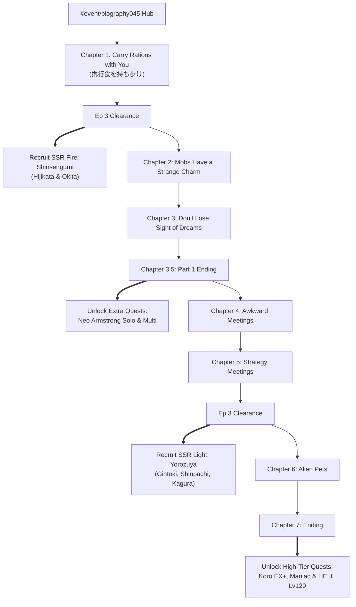

# Volume 15: Event Architecture, Collaboration Subsystems & Operational Optimization KMS

**Version:** 2.0.0  
**Author:** Senior Distributed Systems & Knowledge Architecture Principal  
**Target Repository:** `C:\laragon\www\gbf\data\events\`  
**Compliance:** JSON Schema Draft 2020-12, Zero Duplication Policy, Domain-Driven Design (DDD)  

---

## 1. Executive Summary & Purpose

Granblue Fantasy operates on a continuous, multi-tiered live service event cadence. Outside the permanent raid and farming structures, a significant percentage of a player's active farming, crystal acquisition, and progression materials originates from recurring limited-time events.

Historically, automation logic treated events as monolithic, monthly scenario scripts (`#event/treasureraid<ID>`), relying on basic token drawbox clearing. However, Granblue Fantasy incorporates distinctly different event frameworks with fundamentally divergent economic engines, asset delivery routes, quest progression topologies, and reward structures.

This Volume formalizes the **Event Subsystem Knowledge Management System (KMS)** within `data/events/`, establishing an authoritative, versioned Single Source of Truth (SSOT). Using the live **Gintama Collaboration Event (`biography045`)** as an enterprise case study, this document codifies event routing, CDN media topologies, quest hierarchies, boss mechanics, treasure trade economics, and algorithmic farm optimization.

```
                                  data/events/
 ┌───────────────────────────────────────┼───────────────────────────────────────┐
 │                                       │                                       │
 ▼                                       ▼                                       ▼
1. Event Taxonomy & Engine Lifecycle  2. Master Events Catalog            3. Detailed Event Catalogs
   - biography (Collab / Treasure Trade) - Master Index (events.catalog.json)   - biography045-gintama.catalog.json
   - treasureraid (Scenario Token Box)  - Status & Schedule Tracking            - treasureraid177-cold-heart.catalog.json
   - teamraid (Guild Wars / Dread)      - Advantageous Element Matrix           - Assets, Quests, Drops, Shop
 │                                       │                                       │
 ├───────────────────────────────────────┼───────────────────────────────────────┤
 │                                       │                                       │
 ▼                                       ▼                                       ▼
4. Akamai CDN Media Topology          5. Economic & Farm Optimization         6. Autonomous Combat Execution
   - Top Banners, Logos & Headers        - Medallion & Special Item Math         - 0-Button Quick Summon OTK
   - Character / Weapon / Summon Assets  - Zero-Waste Shop Priority Tiers        - Fire & Light Burst Configurations
   - Story Backgrounds & Audio BGMs      - HELL 3-Clear Skip Thresholds          - Smart Full Auto Recovery
 └───────────────────────────────────────┴───────────────────────────────────────┘
```

---

## 2. Granblue Fantasy Event Taxonomy & Architecture

GBF events are categorized into six distinct architectural models:

| Event Type | Identifier Pattern | Primary Economic Model | Reward Distribution Engine | Primary Farm Targets |
| :--- | :--- | :--- | :--- | :--- |
| **Collaboration (Collab)** | `#event/biography<ID>` | **Treasure Trade Shop** | Fixed-stock Shop exchange using Medallions, Boss Drops, and HELL Parfaits | SSR Collab Characters, Event FLB Weapons, Event FLB Summons, SSR Ticket, Damascus Crystals |
| **Scenario Event (Story)** | `#event/treasureraid<ID>` | **Senka Token Drawbox** | Infinite Gacha Drawboxes (Boxes 1–4 SSR target, Boxes 5–20 Damascus, 21+ infinite) | Damascus Crystals, Half-Elixirs, Quartz/Stones, Box Fodder |
| **Unite and Fight (GW)** | `#event/teamraid<ID>` | **Token Drawbox + Badges** | Preliminary & Final rounds, Honor milestones, Valor Badges (`勲章`) | Revenant Weapons, Sunstones, Evolite, Gold Bricks, Lapis Merit |
| **Dread Barrage** | `#event/teamraid<ID>` | **Token Drawbox + Badges** | Crew star clears, individual defeat honors, Valor Badges | Revenant Weapons, SSR Tickets, Valor Badges |
| **Xeno Clash / Defeat** | `#quest/extra/xeno` | **Treasure Trade Shop** | Xeno Animas, True Animas, Weapon Mod forging | Xeno EX Weapons, True Awakening |
| **Side Stories (Archive)** | `#archive/story/<ID>` | **Permanent Treasure Shop** | Static Medallions and Animas for historical event rewards | Free SSR characters, Gacha tickets, Summon uncap stones |

---

## 3. Collaboration Event Architecture: Case Study `biography045`

The Gintama Collaboration Event (*Gin Tama: Shonen Jump Is Best Enjoyed Cover to Cover* / 『銀魂 少年ならジャンプの裏表紙までちゃんと楽しめ』, internal ID: `biography045`, rerun event index `720`) provides the textbook architecture of a modern CyGames collaboration event.

### 3.1 Hash Routes & State Navigation
- **Event Landing Hub**: `https://game.granbluefantasy.jp/#event/biography045`
  - Loads the custom Backbone view `view/event/biography045/top`.
  - Dispatches GET request to `/biography045/top.json` retrieving:
    - Player currency balances (`item_10397`, `item_10398`, `item_10399`).
    - Story chapter progression index (`cleared_chapter_id`).
    - Daily mission status (`mission_list`).
    - Active Nightmare/HELL proc flag (`is_hell_open`, `hell_quest_id`).
- **Extra Quests Hub**: `https://game.granbluefantasy.jp/#quest/extra/event`
  - Displays Solo Quests: Very Hard, Extreme, Extreme+, Maniac, HELL.
- **Multiplayer Raids Hub**: `https://game.granbluefantasy.jp/#quest/multi/0`
  - Event tab displays: Very Hard Multi, Extreme Multi, Extreme+ Multi.
- **Treasure Trade Shop**: `https://game.granbluefantasy.jp/#shop/exchange/event`
  - Direct deep link to biography045 exchange shop catalog.

### 3.2 Story Progression & Character Recruitment Pipeline
Collaboration events employ a two-part narrative structure where characters are recruited directly through story clearance with **zero gacha dependence**:



- **Free Crystals**: Clearing all 7 narrative nodes awards **$7 \times 50 = 350$ Crystals**.

---

## 4. Akamai CDN Media Topology & Asset Resolution

Granblue Fantasy assets are statically served via Akamai CDN clusters (`prd-game-a-granbluefantasy.akamaized.net` and `prd-game-a1-granbluefantasy.akamaized.net`). Media endpoints adhere to deterministic URI hashing conventions:

### 4.1 Asset URI Specification:
$$\text{URI} = \text{Origin} + \text{Prefix} + \text{Category} + \text{Dimension} + \text{AssetID} + \text{Extension}$$

1. **Event Top Graphics**:
   - `https://prd-game-a-granbluefantasy.akamaized.net/assets/img/sp/banner/events/biography045/top.png`
   - `https://prd-game-a-granbluefantasy.akamaized.net/assets/img/sp/event/biography045/header.png`
   - `https://prd-game-a-granbluefantasy.akamaized.net/assets/img/sp/event/biography045/logo.png`

2. **Playable Character Assets**:
   - **Shinsengumi (ID `3040362000`)**:
     - Thumbnail (Hijikata): `/assets/img/sp/assets/npc/m/3040362000_01_101.jpg`
     - Thumbnail (Okita): `/assets/img/sp/assets/npc/m/3040362000_01_102.jpg`
     - Full Canvas Body (`/b/`): `/assets/img/sp/assets/npc/b/3040362000_01.png`
     - Party Leader Portrait: `/assets/img/sp/assets/leader/m/3040362000_01.jpg`
   - **Yorozuya Gin-chan (ID `3040363000`)**:
     - Thumbnail (Gintoki): `/assets/img/sp/assets/npc/m/3040363000_84.jpg`
     - Thumbnail (Shinpachi): `/assets/img/sp/assets/npc/m/3040363000_85.jpg`
     - Thumbnail (Kagura): `/assets/img/sp/assets/npc/m/3040363000_86.jpg`
     - Full Canvas Body (`/b/`): `/assets/img/sp/assets/npc/b/3040363000_01.png`

3. **Event Equipment Assets**:
   - **SSR Summon: Kotaro Katsura & Elizabeth (ID `2040405000`)**:
     - Thumbnail: `/assets/img/sp/assets/summon/m/2040405000.jpg`
     - Full Summon Illustration: `/assets/img/sp/assets/summon/b/2040405000.png`
   - **SSR Weapon: Wooden Sword Lake Toya (ID `1040913200`)**:
     - Weapon Thumbnail: `/assets/img/sp/assets/weapon/m/1040913200.jpg`
     - Full Blade Illustration: `/assets/img/sp/assets/weapon/b/1040913200.png`

4. **Event Currencies & Article Icons**:
   - **Yorozuya Medallion (ID `10397`)**: `/assets/img/sp/assets/item/article/s/10397.jpg`
   - **Hijikata Special (ID `10398`)**: `/assets/img/sp/assets/item/article/s/10398.jpg`
   - **Fruit Parfait (ID `10399`)**: `/assets/img/sp/assets/item/article/s/10399.jpg`

5. **Audio Endpoints**:
   - Event Hub BGM: `/assets/sound/bgm/bgm_event_biography045_01.mp3`
   - Battle Theme (Neo Armstrong): `/assets/sound/bgm/bgm_event_biography045_battle.mp3`
   - Battle Theme (Koro Boss): `/assets/sound/bgm/bgm_event_biography045_boss.mp3`

---

## 5. Comprehensive Quest & Boss Mechanics Catalog

The event features two distinct boss entities of opposing elements, demanding dual elemental party deployment:

### 5.1 Boss 1: Neo Armstrong Cyclone Jet Armstrong Cannon
- **Element**: Wind ($\text{Wind} \implies$ **Fire Player Advantage**).
- **Encounter Tiers**:
  - `solo_vh` (Lv30, HP 1.25M, 2 Battles)
  - `solo_ex` (Lv50, HP 4.80M, 2 Battles, primary Medallion farm)
  - `solo_maniac` (Lv75, HP 18.0M, 2 Battles, daily 2-run limit)
  - `raid_vh` (Lv30, HP 4.62M, 30-man)
  - `raid_ex` (Lv50, HP 9.68M, 30-man)
  - `hell_lv60` (HP 8.5M) & `hell_lv100` (HP 16.0M)
- **Combat Mechanics**:
  - **Normal Mode**:
    - *Cannon Fire: Annihilation Barrage (砲弾・殲滅射撃)*: 3-hit Wind damage, DEF Down 3 turns.
    - *Scatter Cannon (爆散砲弾)*: Whole party Wind damage, $-30\%$ Charge Bar.
  - **Overdrive Mode**:
    - *National Opening Laser (開国レーザー)*: Heavy Wind AOE damage, dispels all player buffs.
  - **Triggers**:
    - HP 75%: Charge turn MAX.
    - HP 50%: Special attack *National Opening Laser* fires immediately.

### 5.2 Boss 2: Koro (Prince Hata's Alien Pet)
- **Element**: Dark ($\text{Dark} \implies$ **Light Player Advantage**).
- **Encounter Tiers**:
  - `solo_ex_plus` (Lv60, HP 6.20M, 1 Battle, primary Hijikata Special farm)
  - `solo_maniac` (Lv75, HP 22.0M, 2 Battles)
  - `raid_ex_plus` (Lv60, HP 13.2M, 30-man)
  - `hell_lv120` (HP 25.0M, primary Fruit Parfait source)
- **Combat Mechanics**:
  - **Normal Mode**:
    - *Attack Command (攻撃命令)*: 7-hit random Dark damage, grants self DA/TA UP (3 turns).
    - *Ultra Regeneration (超々再生)*: Heals 1,000,000 HP, removes 3 debuffs, gains DEF UP.
  - **Overdrive Mode**:
    - *Wrath Lightning (憤怒雷撃)*: Heavy Dark AOE damage, inflicts **Paralysis (麻痺)** for 1 turn.
  - **Triggers**:
    - Turn 5: Charge turn MAX.
    - HP 50%: Fires *Attack Command* (independent trigger).
    - HP 25%: Fires *Wrath Lightning* (inflicts Paralysis; requires Veil or Clear to avoid turn lockout).

---

## 6. Mathematical Farm Optimization & Treasure Economics

Collaboration event shops do not operate on infinite token drawboxes. Instead, they enforce **finite stock ceilings** across fixed item tiers. Efficient farming requires exact AP/EP budgeting and zero-waste material acquisition.

### 6.1 Exchange Shop Inventory & Item Valuation Matrix

```
┌────────────────────────────────────────────────────────────────────────┐
│                        TREASURE EXCHANGE TIERS                         │
├───────┬───────────────────────────┬───────┬────────────┬───────────────┤
│ Tier  │ Item Name                 │ Stock │ Medallions │ Hijikata Spec │
├───────┼───────────────────────────┼───────┼────────────┼───────────────┤
│ T-0   │ SSR Guaranteed Ticket     │   1   │    300     │      30       │
│ T-0   │ Damascus Crystal          │   3   │    150     │      45       │
│ T-1   │ Kotaro Katsura & Elizabeth│   1   │    300     │     100       │
│ T-1   │ Wooden Sword Lake Toya (4)│   4   │    250     │     125       │
│ T-1   │ Intricacy Ring            │   1   │    120     │      40       │
│ T-1   │ Lineage Ring              │   3   │    150     │      45       │
│ T-1   │ Fire & Light Earrings     │   2   │    240     │      80       │
│ T-2   │ Half-Elixir (150 pots)    │  75   │    750     │       0       │
│ T-2   │ Soul Berry (200 berries)  │ 100   │    400     │       0       │
│ FLB   │ Weapon & Summon 4★ Uncap  │   -   │      0     │      90       │
├───────┴───────────────────────────┴───────┼────────────┼───────────────┤
│ ESSENTIAL COMPLETION TOTAL                │   2,660    │     555       │
│ ESSENTIAL WITHOUT POTS/BERRIES            │   1,510    │     555       │
└───────────────────────────────────────────┴────────────┴───────────────┘
```

*Note on Fruit Parfaits*: 50 Fruit Parfaits are required strictly for 4★ FLB uncapping (30 for Katana, 20 for Summon). Parfaits are never spent in the exchange shop.

### 6.2 Quest Efficiency & AP Conversion Rates

$$\text{Efficiency}_{\text{Medallion}} = \frac{\bar{D}_{\text{medallion}}}{\text{Cost}_{\text{AP}}}$$

$$\text{Efficiency}_{\text{Special}} = \frac{\bar{D}_{\text{special}}}{\text{Cost}_{\text{AP}}}$$

| Quest | AP Cost | Avg. Medallions | Avg. Specials | Medallions / AP | Specials / AP | Clear Time (OTK) |
| :--- | :--- | :--- | :--- | :--- | :--- | :--- |
| **Solo EX (Neo Armstrong)** | 30 | 11.0 | 2.0 | **0.367** | 0.067 | **~2.8s** |
| **Solo EX+ (Koro)** | 30 | 14.0 | 4.0 | **0.467** | **0.133** | **~3.5s** |
| **Solo Maniac (Daily 2/2)**| 50 | 21.0 | 5.0 | 0.420 | 0.100 | ~15.0s |
| **Multi EX (30-man)** | 30 | 2.5 (Red) | 1.5 | 0.083 | 0.050 | Variable |
| **Multi EX+ (30-man)** | 30 | 3.0 (Red) | 2.5 | 0.100 | 0.083 | Variable |
| **HELL Lv120 (0 AP)** | 0 | 18.0 | 5.0 | $\infty$ | $\infty$ | Instant Skip |

### 6.3 Strategic Farm Axioms:
1. **Never Farm Medallions in Multiplayer**: Solo EX+ yields over **4.5x more Medallions per AP** than hosting or joining multiplayer raids. Multiplayer raids should be run strictly for the 5 daily mission clears.
2. **HELL 3-Clear Skip Rule**: Run the first 3 HELL Lv120 spawns manually under Full Auto. Once cleared 3 times, the game permanently unlocks **1-Click Nightmare Skip (`.btn-skip-play`)**, allowing instantaneous 0-second collection of 3 Fruit Parfaits, 5 Specials, and 18 Medallions at zero AP cost.
3. **Parfait Threshold**: Clearing HELL Lv120 exactly 17 times provides $17 \times 3 = 51$ Fruit Parfaits, completely fulfilling the 50 Parfait requirement for both Weapon and Summon FLBs.

---

## 7. Autonomous Combat & 0-Button OTK Blueprints

To achieve maximum throughput without human latency, automated engines deploy optimized party templates configured via `party-selection-rules.json`:

### 7.1 Fire 0-Button Burst vs Neo Armstrong (Wind)
- **Boss HP**: 4,800,000 (Solo EX).
- **Archetype**: Quick Summon Instant Kill or Relic Buster Limit Burst.
- **Execution Script**:
  1. Trigger Quick Summon (`Triple Zero` deals 10,000,000 plain damage, or `Beelzebub 4★` deals 3,000,000 plain damage + Trance buffs).
  2. If HP remains: Relic Buster skill 1 (*Engage Augment*) + skill 2 (*Limit Burst*) $\implies$ 4-chain full burst (25,000,000+ damage).
  3. F5 fast-reload upon attack dispatch, clearing the quest in under 3 seconds.

### 7.2 Light 0-Button Burst vs Koro (Dark)
- **Boss HP**: 6,200,000 (Solo EX+).
- **Archetype**: Light Chrysaor Dual Arts or Triple Zero Quick Summon.
- **Execution Script**:
  1. Trigger Quick Summon (`Triple Zero` instakills with 10M plain damage).
  2. Alternative 0-Button attack: Mainhand `Lu Woh Horn` with double strike ougi burst.

---

## 8. KMS Governance & Automated Verification

In accordance with Principle 1 and Principle 10 of `data/KMS_GOVERNANCE.md`:
1. All event definitions reside within `data/events/events.catalog.json` and `data/events/biography045-gintama.catalog.json`.
2. Every catalog strictly conforms to its schema in `data/schemas/events.schema.json` and `data/schemas/event-detail.schema.json`.
3. Relational integrity is enforced:
   - Elements reference valid identifiers in `data/elements/elements.catalog.json`.
   - Quests and drops link directly to item IDs in `data/network/cdn-assets.json`.
4. Automated verification is executed continuously via `bun tests/test-data-catalog-architecture.ts`.
