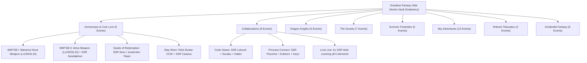
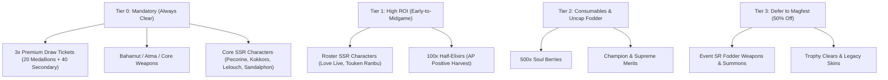

# Volume 16: Granblue Fantasy Side Stories Permanent Vault Architecture

---

## 1. Executive Summary & Permanent Vault Overview

The **Side Stories Subsystem** (`https://game.granbluefantasy.jp/#sidestory`) is Granblue Fantasy's permanent archival vault of legacy scenario events and collaboration campaigns. Introduced as a permanent quality-of-life feature, Side Stories convert time-limited seasonal events into a permanently accessible library of:

1. **Draw Currency & Spark Acceleration**: Over **168 Premium Draw Tickets** (3 per Side Story) and **15,650+ Story Crystals**, totaling more than **100+ Free Gacha Draws** (over one-third of a full 300-draw spark) available immediately at 0 financial cost.
2. **Foundational Equipment Upgrades**:
   - **Bahamut Weapon Nova (Lv100 / Skill 10)**: Rewarded upon completion of *What Makes the Sky Blue (WMTSB I)*. Provides an immediate 30% normal ATK boost across all early grids.
   - **Atma Weapon (Lv100 / Skill 10)**: Rewarded upon completion of *What Makes the Sky Blue II: Paradise Lost (WMTSB II)*. Provides a 20% weapon proficiency ATK boost and 10% HP boost.
   - **Machine Cell Relic Buster CCW**: Rewarded in *Stay Moon*, bypassing the arduous Class Champion Weapon forging line.
3. **Free Frontline Characters**: Over **64 total characters**, including **22 SSR units** across all six elements (such as Kokkoro, Pecorine, Sandalphon, Lelouch, Suzaku, Kallen, Aqours, and μ's), giving new accounts complete 6-element frontline coverage without rolling the gacha.
4. **Permanent Consumable Reserves**: Over **5,600 Half-Elixirs** (up to 100 per story) and **28,000 Soul Berries**, establishing an inexhaustible AP/EP buffer for high-tier raid leeching and Gold Bar racing.

---

## 2. Client Routing, DOM State & Network Architecture

### 2.1 Router Navigation Hashes

Granblue Fantasy's client-side Backbone.js router maps Side Stories to dedicated hashes:

| Hash Pattern | Route Name | Description | Transitions |
| :--- | :--- | :--- | :--- |
| `#sidestory` | `view.sidestory.index` | Master Side Story Hub; carousel, category tabs, and search. | `#sidestory/top/{id}`, `#quest` |
| `#sidestory/top/{id}` | `view.sidestory.top` | Event overview, recruit preview, reward summary, banner art. | `#sidestory/story/{id}`, `#sidestory/quest/{id}` |
| `#sidestory/story/{id}` | `view.sidestory.story` | Interactive episode viewer with episode selector and "Skip" trigger. | `#sidestory/quest/{id}`, `#sidestory/top/{id}` |
| `#sidestory/quest/{id}` | `view.sidestory.quest` | Free Quests (Normal/Hard) and Challenge Quests stage selector. | `#quest/supporter/{questId}/1` |
| `#shop/exchange/side_story/{id}` | `view.shop.exchange` | Treasure trade exchange interface for medallions and secondary treasures. | `#sidestory/top/{id}`, `#mypage` |

### 2.2 REST Endpoints

```
POST /quest/side_story_list
Payload: { "special_token": null }
Response: { "categories": [...], "events": [...] }

POST /quest/side_story_stage/{sidestoryId}
Payload: { "special_token": null }
Response: { "story_status": "cleared"|"uncleared", "episodes": [...], "quests": [...] }

POST /quest/side_story_skip/{sidestoryId}
Payload: { "special_token": null }
Response: { "result": "success", "rewards": [{ "type": "crystal", "count": 250 }, { "type": "character", "id": "3040180000" }] }

POST /shop_exchange/side_story/purchase
Payload: { "special_token": null, "item_id": "ticket_1", "exchange_count": 3, "sidestory_id": 1001 }
Response: { "success": true, "remaining_stock": 0, "currency_balance": { "medallion": 12, "secondary": 8 } }
```

### 2.3 Akamai CDN Asset Topology

Side story graphical assets are distributed via the high-bandwidth edge CDN `https://prd-game-a-granbluefantasy.akamaized.net`:

- **Event Header**: `/assets/img/sp/event/sidestory/{sidestoryId}/header.png`
- **Banner Carousel**: `/assets/img/sp/banner/events/sidestory/{sidestoryId}/top.png`
- **Quest Thumbnail**: `/assets/img/sp/quest/scene/character/body/{bgId}.jpg`
- **Treasure Medallions**: `/assets/img/sp/assets/item/article/s/{itemId}.jpg`

---

## 3. Taxonomy of Side Story Sagas (8 Strategic Categories)



### 3.1 Anniversary & Core Lore (`anniversary`)
- **Key Mechanics**: Delves into Astral and Primal history, the rebellion of Lucilius, the Supreme Primarch Lucifer, and the origins of the Sky Realm.
- **Critical Unlocks**:
  - *WMTSB I*: Clear Main Quest Ch 54. Awards 3x Draw Tickets, 350 Crystals, and **Bahamut Weapon Nova**.
  - *WMTSB II*: Awards **Atma Weapon** and SSR Sandalphon (Light).
  - *Seeds of Redemption*: Awards SSR Seox or an Eternal recruitment token.
  - *Stay Moon*: Awards Machine Cell Relic Buster CCW and SSR Cassius.

### 3.2 Collaborations (`collaboration`)
- **Key Mechanics**: Highest density of free SSR characters in the entire game.
- *Princess Connect! Re:Dive*: Provides SSR Pecorine (premier defensive tank), SSR Kokkoro (wind battery & normal ATK buffer), SSR Karyl.
- *Code Geass*: Provides SSR Lelouch (Dark team buffer), SSR Suzaku (Wind dodge tank), SSR Kallen (Fire attacker).
- *Love Live! Sunshine!! & Door to the Skies*: Provides 6 SSR trio units covering all 6 elements.

### 3.3 The Dragon Knights of Feendrache (`dragon_knights`)
- Follows the Feendrache chivalric order (*Defender's Oath*, *Four Knights*, *Between Frost and Flame*, *Divergent Knighthoods*, *Bistro Feendrache*, *White Heron's Song*).
- Awards SR Vane, SR Lancelot, SR Percival, SR Arthur, and chef skin cosmetics.

### 3.4 The Society & The Foes (`society`)
- Deep investigative thriller following the Organization operatives (*Footprints on Sacred Ground*, *Gripping Freedom*, *Platinum Sky*, *Right Behind You*, *Second Advent*, *Spaghetti Syndrome*, *Home Sweet Home*).
- Awards SR Sen, SR Meteon, SR Beatrix, SR Cassius, and Formula Machine summon.

### 3.5 Summer Festivities (`summer`)
- Auguste Island vacation arcs (*Poacher's Day*, *A Slice of Summer*, *The Maydays*, *Kappa Summer Chronicle*, *My Beloved Auguste*).
- Awards Summer Lunalu, Summer Jin, Summer Elmott, Meg, and Bruce summon.

### 3.6 Sky Adventures, Robomi & Cinderella Fantasy
- *Sky Adventures*: Includes *Festival of Falling Flame* (the very first event in GBF history, March 2014), *Lonesome Dragoness*, and *Balmy Breeze and Foamy Deep*.
- *Robomi*: Sentai tokusatsu action series featuring Robomi and Gigantes.
- *Cinderella Fantasy*: Extensive 8-part Idolm@ster crossover featuring dozens of voiced idol units.

---

## 4. Economic Optimization & Spark Math

```
Total Side Stories Documented: 56
Premium Draw Tickets: 56 × 3 = 168 Tickets (168 Draws)
Story Crystals: ~250 - 350 per story = ~15,650 Crystals (~52 Draws)
Total Direct Gacha Draws: 220 Draws (~73% of a full 300-draw Spark!)
Half-Elixirs Available: 56 × 100 = 5,600 Half-Elixirs (+280,000 AP)
Soul Berries Available: 56 × 500 = 28,000 Soul Berries (+140,000 EP)
```

### 4.1 Currency Exchange Tiering



---

## 5. Automation & Speed-Clearing Pipeline

The Granblue Fantasy Remote Controller executes Side Story farming via an optimized 3-stage pipeline:

1. **Stage 1: One-Click Story Skip**:
   - The engine triggers the in-game Story Skip button or navigates directly to the final chapter.
   - All story episodes are resolved in under 2 seconds per event, immediately granting 250-350 crystals and joining characters without AP expenditure.
2. **Stage 2: 0-Button Plain Damage Quest Burst**:
   - Equips Sarasa (`Ground Zero`) or Gladiator/Swordmaster (`Awakening` / Disparia).
   - Single Quests (Normal: 10 AP, Hard: 15 AP) are annihilated in 1 turn (3.8s per run).
   - Farms exactly the 20 Medallions and 40 Secondary Treasures needed to buy out all 3 Premium Draw Tickets.
3. **Stage 3: Magfest Campaign Pacing**:
   - When active, Cygames' **Half-AP and Half-Treasure Campaign** cuts ticket exchange costs from 20/40 down to 10/20 medallions!
   - The automation scheduler automatically flags non-essential side stories to be held for Magfest, doubling overall AP efficiency.

---

## 6. Governance & Validation Summary

- **Schema Compliance**: Conforms to Draft 2020-12 schemas in [`data/schemas/side-stories.schema.json`](file:///C:/laragon/www/gbf/data/schemas/side-stories.schema.json) and [`data/schemas/side-story-optimizer.schema.json`](file:///C:/laragon/www/gbf/data/schemas/side-story-optimizer.schema.json).
- **Service Integration**: Fully indexed in [`DataCatalogService`](file:///C:/laragon/www/gbf/src/domain/data/data-catalog.service.ts) with $O(1)$ lookups.
- **Architectural Tests**: Validated by automated test assertions in [`tests/test-data-catalog-architecture.ts`](file:///C:/laragon/www/gbf/tests/test-data-catalog-architecture.ts).
