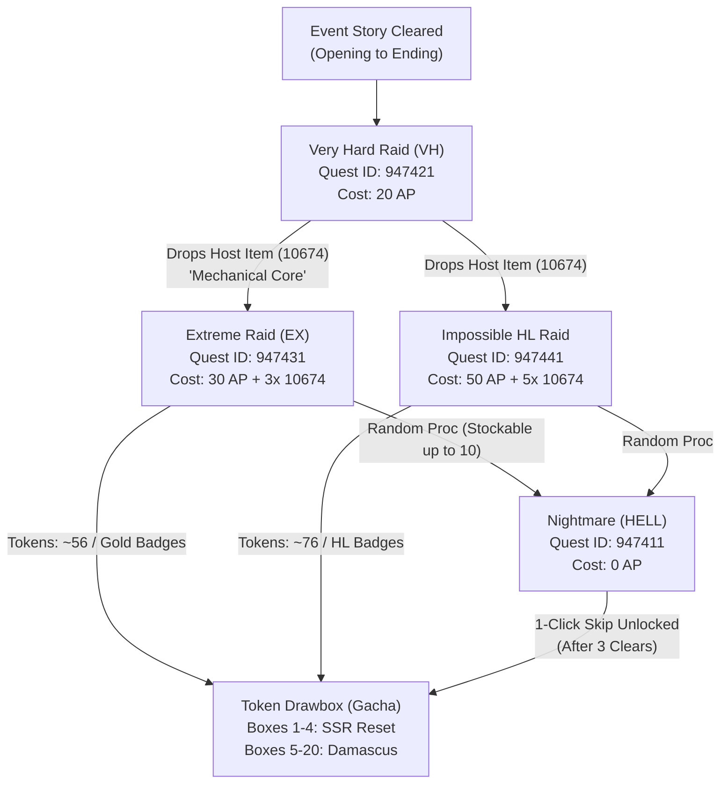

# Granblue Fantasy Scenario Event Architecture & Automation Guide

This guide establishes the comprehensive technical, algorithmic, and operational architecture for Granblue Fantasy's monthly **Scenario Events** (also known as **Treasury Raid** / **Token Drawbox** events).

---

## 1. Executive Summary & Event Typology

Granblue Fantasy scenario events occur on a monthly cadence (typically commencing late in the month and spanning 8–9 days). They represent one of the game's core progression loops, rewarding:
- **Event Tokens (戦貨 - Senka)** for the Token Drawbox (Boxes 1–4 contain SSR Summons/Weapons; Boxes 5–20 contain Damascus Crystals; infinite boxes provide Half-Elixirs and Rupies).
- **Battle Badges** (Bronze, Silver, Gold).
- **Honor Milestones** (Crystals, Tickets, Rings, Earring items).
- **1-Time Challenge Quest** (Blue Sky Crystals & Event Trophy).
- **Daily Event Missions** (50 Crystals daily for clearing 5 multi-battles).

All scenario events share an identical internal engine framework (`treasureraid<ID>`), URL routing schema, DOM structures, and state transitions. Mastering **Event 177 ("Farewell, Cold Heart")** creates an evergreen blueprint for all future events.

---

## 2. In-Game Route Anatomy & Direct Endpoints

Granblue Fantasy utilizes a Backbone-driven single-page application (SPA) with hash-based routing. Knowing the direct hash URLs eliminates UI traversal overhead and bypasses animation layers.

### Route Overview for Event 177 ("Farewell, Cold Heart"):

| Component | Route Hash | Full URL |
| :--- | :--- | :--- |
| **Event Top Page** | `#event/treasureraid177` | `https://game.granbluefantasy.jp/#event/treasureraid177` |
| **Solo Quests / Maniac**| `#event/treasureraid177/quest` | `https://game.granbluefantasy.jp/#event/treasureraid177/quest` |
| **Challenge Quest** | `#event/treasureraid177/challenge`| `https://game.granbluefantasy.jp/#event/treasureraid177/challenge` |
| **Token Drawbox (Gacha)**| `#event/treasureraid177/gacha` | `https://game.granbluefantasy.jp/#event/treasureraid177/gacha` |
| **Very Hard (VH) Raid**| `#quest/supporter/947421/1` | `https://game.granbluefantasy.jp/#quest/supporter/947421/1` |
| **Extreme (EX) Raid** | `#quest/supporter/947431/1/0/10674` | `https://game.granbluefantasy.jp/#quest/supporter/947431/1/0/10674` |
| **Impossible (HL) Raid**| `#quest/supporter/947441/1/0/10674` | `https://game.granbluefantasy.jp/#quest/supporter/947441/1/0/10674` |
| **Nightmare (HELL)** | `#quest/supporter/947411/3` | `https://game.granbluefantasy.jp/#quest/supporter/947411/3` |

### URL Parameter Decomposition:
Format: `#quest/supporter/<QUEST_ID>/<BATTLE_TYPE>/<RESERVED>/<CONSUMED_ITEM_ID>`
- `<QUEST_ID>`: Unique 6-digit quest identifier (e.g. `947431`).
- `<BATTLE_TYPE>`: `1` for standard multi-battle/raid, `3` for Nightmare solo.
- `<RESERVED>`: Unused parameter slot (typically `0`).
- `<CONSUMED_ITEM_ID>`: In-game item ID required to host (e.g. `10674` = Mechanical Core).

---

## 3. Raid Hierarchy & Economy Loop



### Detailed Raid Economics:
1. **Very Hard (VH) - "Drone Assault" (ID: 947421)**:
   - **Cost**: 20 AP, 0 items.
   - **HP**: ~4.2M HP.
   - **Purpose**: "Meat" farming. Drops 1–3 host items (`10674`) per battle.
   - **Yield**: ~22 tokens, Bronze/Silver badges.

2. **Extreme (EX) - "Strength of Humanity" (ID: 947431)**:
   - **Cost**: 30 AP + 3x host item (`10674`).
   - **HP**: 12.0M HP (Lvl 50 Ohr Morhes).
   - **Optimal Rotation**: 0-Button 1-Summon Quick Call kills the boss instantly (~12M+ damage).
   - **Yield**: ~56 tokens, Gold badges, SSR weapon/summon drops, high Nightmare proc rate.

3. **Impossible (HL) - "Ohr Morhes (Impossible)" (ID: 947441)**:
   - **Rank Requirement**: Rank 101+.
   - **Cost**: 50 AP + 5x host item (`10674`).
   - **HP**: 45.0M HP (Lvl 100 Ohr Morhes).
   - **Yield**: ~76 tokens, HL badges, Damascus grains, Blue/Red chest loot.

---

## 4. Nightmare (HELL) & Stocking Mechanics

Modern GBF scenario events incorporate the **Nightmare Stocking System**:
- Nightmares stock up to dozens or hundreds of attempts (`data-hell-skip-remain-count`).
- **Nightmare Skip**: Once the player unlocks Nightmare Skip, clicking the Nightmare banner opens the "Unparalleled Foe" modal with the `#hell-skip-setting` toggle and `#skip-num-count` dropdown.
- **10x Batch Looper**: The looper (`bun run event:nightmare`) automatically verifies the Skip checkbox is active, selects the maximum 10x batch count, clicks "Claim Loot", confirms party selection on `#quest/supporter`, sweeps the `#result_hell_skip` screen, and loops continuously until all Nightmare battles are depleted.

---

## 5. Token Drawbox (Senka Gacha) Strategy

Route: `#event/treasureraid<ID>/gacha`

### Box Progression Logic:
1. **Boxes 1–4**:
   - Primary Reward: Event SSR Summon or SSR Weapon.
   - Strategy: Early reset enabled. The moment the SSR is pulled, reset immediately (`.btn-box-reset`) to advance to the next box, minimizing token waste.
2. **Boxes 5–20**:
   - Primary Reward: Damascus Crystal (1 per box).
   - Strategy: Must empty completely to ensure all Damascus Crystals are secured.
3. **Boxes 21+**:
   - Infinite half-elixir, berry, and rupie farm.

---

## 6. Standardized CLI Workflows

The remote controller provides dedicated, high-speed CLI commands powered by Bun:

### 1. High-Speed Raid Looping:
```bash
# Loop Extreme Raid (default 500 runs):
bun run event:raid

# Loop specific run counts:
bun run event:raid ex 50
bun run event:raid vh 30
bun run event:raid hl 20

# Run in windowed browser:
bun run event:raid:windowed

# Run on secondary account:
bun run event:raid acc2 ex 50
```

### 2. Event Story & Side Content:
```bash
# Verify / Clear all unread story chapters & episodes:
bun run event

# Complete Full Pipeline (Story -> Challenge -> Maniac -> Nightmare -> Gacha):
bun run event:all

# Nightmare (HELL) Solo Skip Looper (10-skip batched loop until 0 remain):
bun run event:nightmare

# Token Drawbox Clearer (Draw 1 Drawbox -> Tap skip crystal -> Reload loot bypass -> Reset box -> Repeat):
bun run event:gacha          # Clears up to 200 boxes or until tokens depleted
bun run event:token          # Alias for event:gacha
bun run event:gacha 177 50   # Clear up to 50 boxes for event 177

# Specific side tasks:
bun run event:challenge
bun run event:maniac
```

### 3. Declarative Workflow Integration:
```bash
# Run through Universal Workflow Engine:
bun src/cli/run-workflow.ts acc1 event-raid 100
```

---

## 7. Future Event Extensibility Blueprint

When a new scenario event releases (e.g. `treasureraid178`):
1. **Event ID**: Automatically detected from `#event/treasureraid<ID>`.
2. **Quest ID Derivation**:
   - Very Hard: `<prefix>21`
   - Extreme: `<prefix>31`
   - Impossible: `<prefix>41`
   - Nightmare: `<prefix>11`
3. **Host Item ID**: Parsed from the raid link data attribute `data-treasure-id="XXXXX"` on the event top page or configured in `src/events/event.constants.ts`.
