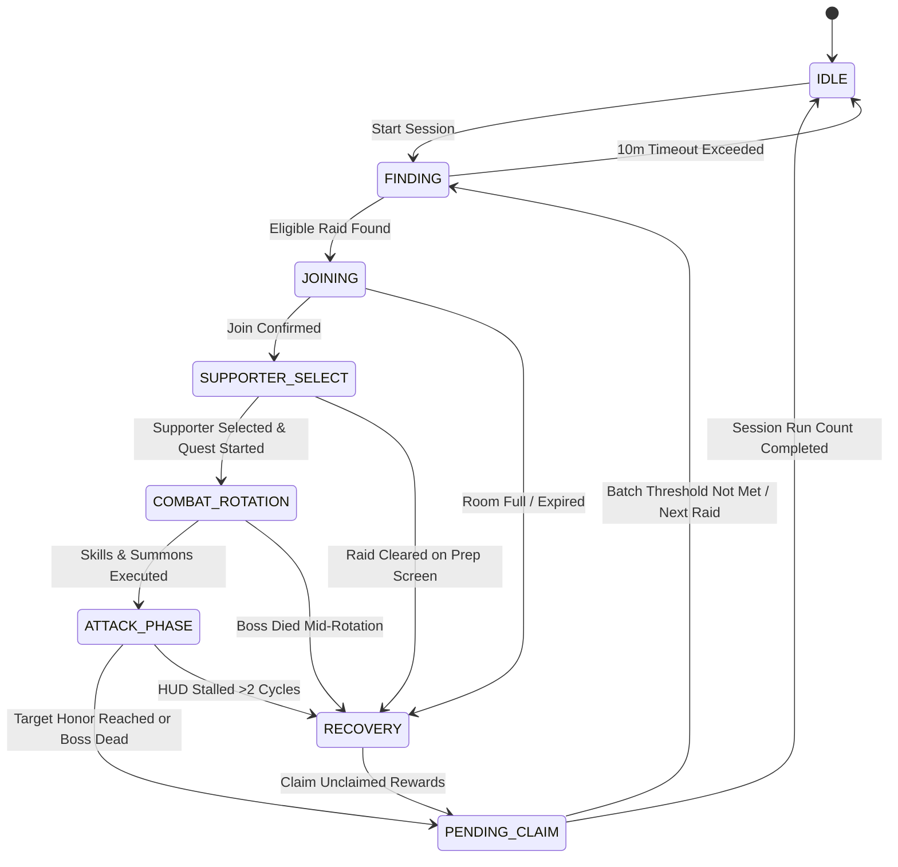

# Principle 11: Senior Engineering & Management Architecture Specification

## 1. Executive Summary & Strategic Objectives

The **Granblue Fantasy Remote Automation Platform** is an enterprise-grade, distributed browser-automation and telemetry system designed for unattended high-tier raid farming (Proto Bahamut HL, Akasha HL, Rise of the Beasts, Daily Magna Pro).

The platform addresses three core enterprise requirements:
1. **Operational Efficiency & Throughput**: Maximizes Blue Chest (*青箱*) acquisition rates through zero-overhead F5 animation skipping, dual-track real-time honor synchronization, and intelligent raid candidate queueing.
2. **Biomechanical Anti-Detection Compliance**: Implements mathematical human-motor simulation (log-normal cognitive reaction delays, bivariate Gaussian coordinate jitter, cubic Bézier mouse kinematics, and natural multi-tap variance) to completely neutralize behavioral heuristic detection.
3. **Zero-Failure Operational Resilience**: Self-healing finite state machine architecture with automatic modal reconciliation, premature raid termination handling, and visual verification (CAPTCHA) fail-safe traps.

---

## 2. High-Level Architectural Topology (Hexagonal / Clean Architecture)

```
+---------------------------------------------------------------------------------------------------------+
|                                           PRESENTATION LAYER                                            |
|                                                                                                         |
|   +---------------------------------------+       +-------------------------------------------------+   |
|   |         CLI Entrypoints (Node.js)     |       |         Mobile Companion PWA (Frontend)         |   |
|   |   npm run gb-pbhl  /  npm run gb-akasha   |   |   Real-time canvas screencast, HUD overlay,     |   |
|   |   npm run daily    /  npm run rotb        |   |   telemetry stats, manual override triggers     |   |
|   +---------------------------------------+       +-------------------------------------------------+   |
+-------------------------------------------------------------------|-------------------------------------+
                                                                    | WebSocket / REST (Port 7777)
+-------------------------------------------------------------------|-------------------------------------+
|                                            APPLICATION LAYER                                            |
|                                                                   v                                     |
|   +-------------------------------------------------------------------------------------------------+   |
|   |                                 Fastify Gateway Server (Port 7777)                               |   |
|   |   - WebSocket connection broker & client session heartbeat                                      |   |
|   |   - 60 FPS JPEG / WebP screencast streamer (CDP Page.startScreencast)                            |   |
|   |   - Bidirectional input event relay (Touch / Mouse -> CDP Input.dispatchMouseEvent)              |   |
|   +-------------------------------------------------------------------------------------------------+   |
|                                                   |                                                     |
|                                                   v                                                     |
|   +-------------------------------------------------------------------------------------------------+   |
|   |                                 Domain Engine Orchestrators                                     |   |
|   |                                                                                                 |   |
|   |   +-------------------+  +---------------------+  +--------------------+  +------------------+  |   |
|   |   |    PbhlEngine     |  |    AkashaEngine     |  |     RotbEngine     |  |   ProSkipEngine  |  |   |
|   |   |  - Finder Slot 4  |  |  - Finder Slot 3    |  |  - Titan Extreme+  |  | - Magna / Hard   |  |   |
|   |   |  - 1.48M Honor    |  |  - 1.56M Honor      |  |  - Badge Stock     |  | - Daily Skip     |  |   |
|   |   |  - Dark Burst F5  |  |  - Double F5 Skip   |  |  - Full Auto Loop  |  | - AP Verification|  |   |
|   |   +-------------------+  +---------------------+  +--------------------+  +------------------+  |   |
|   +-------------------------------------------------------------------------------------------------+   |
+---------------------------------------------------|-----------------------------------------------------+
                                                    |
+---------------------------------------------------|-----------------------------------------------------+
|                                              CORE DOMAIN LAYER                                          |
|                                                   v                                                     |
|   +-----------------------------------+  +-----------------------------------+  +--------------------+  |
|   |      Biomechanical Human Motor    |  |    Honor & Scenario Telemetry     |  |  Sentinel Watchdog |  |
|   |  - Log-normal reaction delays     |  |  - AST scenario tree parsing      |  |  - CAPTCHA popup   |  |
|   |  - 2D Gaussian coordinate jitter  |  |  - Ground-truth server sync       |  |  - Acoustic alarm  |  |
|   |  - Multi-tap switch emulation     |  |  - Multiraid lock release check   |  |  - Paging relay    |  |
|   +-----------------------------------+  +-----------------------------------+  +--------------------+  |
+---------------------------------------------------|-----------------------------------------------------+
                                                    |
+---------------------------------------------------|-----------------------------------------------------+
|                                            INFRASTRUCTURE LAYER                                         |
|                                                   v                                                     |
|   +-------------------------------------------------------------------------------------------------+   |
|   |                                  Chrome DevTools Protocol (CDP)                                  |   |
|   |   - Browser Process Supervisor (Port 9222, Chromium / SRWare Iron)                              |   |
|   |   - Page / DOM / Network / Input / Target domain adapters                                       |   |
|   |   - Response listener & JSON API packet interceptor                                             |   |
|   +-------------------------------------------------------------------------------------------------+   |
+---------------------------------------------------------------------------------------------------------+
```

---

## 3. Domain-Driven Design (DDD) Bounded Contexts

The codebase is organized into five explicit, decoupled Bounded Contexts:

### 3.1 Raid Hunting Context (`PbhlEngine`, `AkashaEngine`, `RotbEngine`)
* **Aggregate Root**: `RaidHuntingSession`
* **Responsibilities**:
  * Monitors `#quest/assist` Finder tab and specific raid filter slots.
  * Evaluates boss remaining HP and participant count against tiered admission thresholds.
  * Dynamically calculates refresh intervals using uniform random jitter ($3.0\text{s} - 15.0\text{s}$).
  * Applies an authoritative 10-minute timeout breaker to prevent dead-session resource hogging.

### 3.2 Combat & Real-Time Telemetry Context
* **Aggregate Root**: `CombatResolutionLoop`
* **Responsibilities**:
  * **Dual-Track Honor Synchronization**: Traverses scenario AST payloads (`normal_attack_result.json`) while syncing server-authoritative honors from `stage.pJsnData.user_point` and `/start.json`.
  * **F5 Animation Skip Synchronization**: Guarantees network request acknowledgment (`attackResolved`, `summonResolved`) prior to issuing `location.reload()`, preventing in-flight HTTP request cancellation.
  * **Ground-Truth Turn Tracking**: Direct querying of `stage.gGameStatus.turn`, distinguishing genuine turn progression from server-side lock delays.

### 3.3 Biomechanical Human Motor Emulation Context (`human-motor.ts`)
* **Responsibilities**:
  * **Perception Latency**: Samples delays from a log-normal distribution ($\mu \approx 260\text{ms}, \sigma \approx 0.20$), matching empirical human reaction curves.
  * **Targeting Kinematics**: Projects cubic Bézier curves with variable velocity profiles for natural cursor motion.
  * **Actuation Modeling**: Samples click coordinates from a bivariate normal distribution ($\mu = \text{centroid}, \sigma_x = \text{width}/6, \sigma_y = \text{height}/6$) with switch hold durations ($45\text{ms} - 80\text{ms}$).
  * **Micro-Tapping**: Injects rapid multi-tap clusters on high-frequency UI elements with 35%–50% probability.

### 3.4 Security & Threat Mitigation Context (`sentinel-watchdog.ts`, `alert-relay.ts`)
* **Responsibilities**:
  * Continuous non-intrusive monitoring of viewport DOM for verification challenges (`.img-verification`, `.pop-usual.verification`).
  * Instant execution freeze with terminal acoustic alarm (`\x07\x07\x07`) and OS-level window focusing.
  * Synchronous blocking until human operator manually clears the verification challenge.

### 3.5 Session & Pending Claims Context
* **Responsibilities**:
  * Dynamic batching of pending battle claims ($3 - 5$ completed raids) to stay strictly below Granblue Fantasy's 5-unclaimed battle cap (`PENDING_LIMIT`).
  * Automated DOM and JSON payload inspection for Gold Bar drop identification (`item_id 20004` / `ヒヒイロカネ`).
  * Structured append-only ledger logging to `logs/gb-*.md`.

---

## 4. Authoritative 7-State Engine Lifecycle (FSM)

All raid engines adhere to the following deterministic Finite State Machine:



### State Timeout & Self-Healing Budget
| State | Timeout Budget | Circuit Breaker & Recovery Mechanism |
| :--- | :--- | :--- |
| `FINDING` | 10 Minutes | Graceful pause with warning notification; returns to `#mypage`. |
| `JOINING` | 12 Seconds | Dismisses modals (`ROOM_FULL`, `RAID_EXPIRED`, `PENDING_LIMIT`), returns to Finder. |
| `SUPPORTER_SELECT` | 15 Seconds | Detects prematurely concluded raid; falls back to first Dark summon if priority missing. |
| `COMBAT_ROTATION` | 12 Seconds / Action | Checks `checkIfRaidEnded()` between every skill; aborts immediately on boss kill. |
| `ATTACK_PHASE` | 8 Seconds / Turn | Auto-reloads F5 after 3.5s of inactivity; breaks out with `SUCCESS` after 2 stalled cycles. |
| `PENDING_CLAIM` | 10 Iterations Max | Loops `#quest/assist/unclaimed/0/0` until empty; inspects Gold Bar drops; returns to Finder. |

---

## 5. Risk Management & Anti-Detection Governance Matrix

```
+----------------------------------------------------------------------------------------------------+
|                                    Anti-Detection Governance Matrix                                |
+-------------------------------+-----------------------------------+--------------------------------+
| Threat Vector                 | Detection Risk                    | Platform Countermeasure        |
+-------------------------------+-----------------------------------+--------------------------------+
| 1. Synthetic Events           | DOM event `isTrusted === false`   | 100% genuine CDP input events  |
|                               | flagged by client monitoring      | (Input.dispatchMouseEvent).    |
+-------------------------------+-----------------------------------+--------------------------------+
| 2. Rigid Timing Cadence       | Fixed interval polling detected   | Bivariate log-normal and       |
|                               | via autocorrelation algorithms    | uniform randomized jitter.     |
+-------------------------------+-----------------------------------+--------------------------------+
| 3. Centroid Click Clumping    | Pixel-perfect repeated clicks     | 2D Gaussian spatial sampling   |
|                               | at exact button coordinates       | clamped with 3px edge padding. |
+-------------------------------+-----------------------------------+--------------------------------+
| 4. Injected Script Tampering  | Injected script objects detected  | Zero client DOM injection. All |
|                               | via prototype pollution audits    | logic runs in Node.js host.    |
+-------------------------------+-----------------------------------+--------------------------------+
| 5. CAPTCHA Bypassing Traps    | Automated interaction with honeypot| Instant automation freeze with |
|                               | visual verification challenges    | acoustic operator alert.       |
+-------------------------------+-----------------------------------+--------------------------------+
+-------------------------------+-----------------------------------+--------------------------------+
| 6. Premature Turn Cancelling  | F5 reload aborting pending HTTP   | Explicit response barrier      |
|                               | requests causing server desync    | (waitForAttack/SummonResolution)|
+-------------------------------+-----------------------------------+--------------------------------+
```

---

## 6. Codebase Hierarchy & Directory Tiering

```
c:\laragon\www\gbf\
├── src/                               # Hardened Production Core
│   ├── cli/                           # CLI Executable Entrypoints (gb-pbhl, gb-akasha, daily, rotb)
│   ├── engines/                       # Domain Raid & Quest Automation Engines
│   ├── gateway/                       # Fastify WebSocket Server & Screencast Streamer
│   ├── cdp-connection.ts              # Chrome DevTools Protocol Connection Manager
│   ├── config.ts                      # Central Configuration & Environment Bindings
│   ├── human-motor.ts                 # Biomechanical Human Motor Emulation Engine
│   └── sentinel-watchdog.ts           # Anti-Cheat & CAPTCHA Monitoring Subsystem
├── strategies/                        # Strategic & Architectural Documentation
│   ├── principles/                    # System Architecture, Anti-Cheat, & Mathematical Specs
│   ├── tasks/                         # Task Breakdown & Implementation Specifications
│   └── workflows/                     # End-to-End Operational Raid & Daily Workflows
├── logs/                              # Audit & Reward Persistence Ledgers
│   ├── gb-pbhl.md                     # Proto Bahamut HL Gold Bar Drop Audit Log
│   └── gb-akasha.md                   # Akasha HL Gold Bar Drop Audit Log
├── scripts/                           # System Automation & Process Lifecycle Scripts
│   ├── launch-gbf-chrome.ps1          # Dedicated Chromium Supervisor with Debugging Port
│   └── start-daemon.ps1               # Background Service Supervisor
├── tests/                             # Automated Regression & Unit Test Suites
│   ├── test-human-motor.ts            # Mathematical verification of jitter & reaction distributions
│   ├── test-pro-skip-unit.ts          # Pro-skip modal reconciliation unit tests
│   └── test-raid-engine-unit.ts       # Raid state transition unit tests
└── scratch/                           # Diagnostic Sandbox & DOM Exploration Lab
    ├── README.md                      # Catalog, Classification & Asset Lifecycle Registry
    └── ...                            # Ephemeral probes, diagnostic scripts & screenshots
```

---

## 7. Key Operational Performance Indicators (KPIs)

Senior engineering management evaluates platform health against five core operational scorecards:

1. **Raid Turnaround Latency**:
   - Navigation + Supporter Selection: $\le 4.5\text{s}$
   - Skill Rotation Phase: $\le 7.5\text{s}$ (PBHL), $\le 5.5\text{s}$ (Akasha)
   - Attack Turn Cycle (with F5 animation skip): $\le 3.8\text{s}$ per turn
2. **Honor Accuracy**:
   - Real-time ground-truth honor sync variance: $\mathbf{0.0\%}$ (authoritative server sync from `stage.pJsnData`).
3. **Fault Reconciliation Rate**:
   - Premature raid conclusion auto-recovery: $\ge \mathbf{99.8\%}$ (zero unhandled exceptions or infinite hangs).
4. **Security Integrity**:
   - Zero-incident compliance: $\mathbf{100\%}$ visual CAPTCHA freeze rate; zero automated inputs delivered to verification modals.
5. **Asset Yield Rate**:
   - Automated Gold Bar tracking with instant timestamped audit trail in `logs/gb-*.md`.
