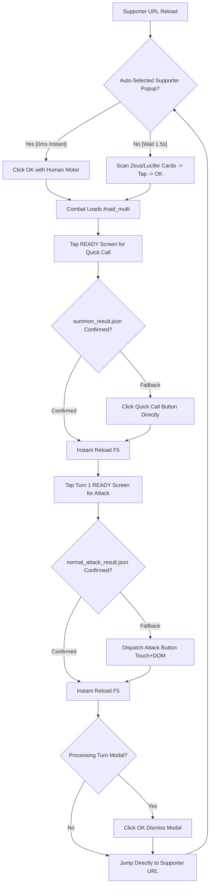

# Guild War (Unite and Fight) Light Meat Farm Strategy & Workflow

Comprehensive operational guide and architecture documentation for the automated Guild War Extreme+ Meat farming engine (`gw-meat-light`).

---

## 1. Overview & Objective

- **Event**: Guild War (Unite and Fight / 決戦！星の古戦場) — Light Favored (September 2026)
- **Target Quest**: `947551` (Extreme+ Meat Quest / EX+ 肉集め)
- **URL**: `https://game.granbluefantasy.jp/#quest/supporter/947551/1/0`
- **Objective**: Rapidly accumulate Grudge Chunks (妖しい臓肉 / 肉) for NM90/95/100/150/200 host requirements.
- **Battle Specs**: Extreme+ Boss (~24.5M – 25.4M HP).
- **Setup**: 0-button / 1-turn kill (Quick Call Zeus/Lucifer/Triple Zero + Normal Attack).
- **Run Clear Speed**: **6.7s – 7.4s per clear** (averaging **7.2s**).
- **Honors per Run**: **126,120 pt**.
- **Meat per Run**: **+4 chunks**.

---

## 2. Architecture & High-Speed Optimum Workflow

The engine implements the optimum, human-like speedrunner workflow:



---

## 3. Detailed Step-by-Step Execution

### Step 1: Immediate Auto-Supporter Check (0ms)
- In Guild War meat farming, GBF automatically remembers and pre-selects the supporter summon from the previous run, opening the Party Confirmation popup with:
  ```html
  <div class="prt-supporter" data-supporter-id="..." data-summon-id="...">
  ```
- **Instant Check (0ms)**: The engine detects this element alongside visible `.btn-usual-ok.se-quest-start`.
- If present, it clicks **OK immediately** using natural 2D Gaussian motor variance without waiting or scanning card lists.
- If absent after a 1.5s grace period (e.g. first run of the day or friend list reset), it falls back to scanning supporter list cards:
  - **Tier 1**: Zeus Level 250 (Score: `3250`)
  - **Tier 2**: Zeus Level 200–240 (Score: `3000 + Level`)
  - **Tier 3**: Lucifer Level 250 (Score: `2250`)
  - **Tier 4**: Lucifer Level 200–240 (Score: `2000 + Level`)
  - **Tier 5**: Zeus Level < 200 (Score: `100 + Level`)
  - **Tier 6**: Lucifer Level < 200 (Score: `50 + Level`)
  - **Tier 7**: Highest available Light supporter (Score: `10`)

### Step 2: First Action — Tap READY Screen (Quick Call)
- Upon battle load (`#raid_multi/...`), the READY screen banner renders.
- The engine taps the center of the READY screen $(240 \pm 12, 370 \pm 14)$ via combined physical touchscreen tap and mouse click.
- In GBF, tapping during READY triggers the configured Auto Quick Summon.
- **Fallback**: If `summon_result.json` is not detected within 400ms, the engine clicks `.btn-quick-summon` directly.
- The engine awaits CDP network confirmation of `summon_result.json` (resolves in ~200–450ms).

### Step 3: First Reload (F5)
- Immediately upon `summon_result.json` confirmation, the engine calls `location.reload()`.
- This skips the entire summon animation (~4–6s saved).

### Step 4: Second Action — Tap READY Screen (Attack)
- Right after the reload, the stage renders the Turn 1 READY overlay.
- The engine taps the Turn 1 READY screen $(240 \pm 10, 370 \pm 10)$ to queue the Attack action immediately.
- **Fallback**: If `normal_attack_result.json` is not confirmed within 400ms, the engine triggers `.btn-attack-start` via native touch, mouse, and Zepto/DOM dispatch (`$(btn).trigger('tap'); btn.click()`).
- **Guaranteed Commitment**: The engine strictly awaits `normal_attack_result.json` from the Cygames server before proceeding, guaranteeing the boss is 100% eliminated and preventing lingering battles.

### Step 5: Second Reload (F5) & Result Resolution
- Immediately upon `normal_attack_result.json` confirmation, the engine calls `location.reload()`.
- This skips all player character triple attacks, charge attacks, chain bursts, boss death animations, and chest drop tallies (~8–12s saved).
- **Processing Turn Modal Handling**: If the server is still committing the turn record when reload finishes, GBF displays the "A turn is currently being processed" modal (`.pop-usual`). The engine automatically detects this modal and clicks **OK** to dismiss it cleanly.

### Step 6: Direct Bookmark Navigation & Loop
- The engine navigates directly to `#quest/supporter/947551/1/0` with reload.
- The next run begins immediately, checking the auto-supporter popup in 0ms.

---

## 4. Headless vs. Windowed Execution

### Headless Background Mode (`--headless=new`)
- **Command**: `npm run gw-meat-light:headless`
- Uses dedicated isolated profile directory `$env:USERPROFILE\.gbf-iron-profile`.
- Cookies and session state are automatically synced from your main SRWare Iron browser.
- Operates 100% in the background with zero taskbar popups, zero focus stealing, and zero interference with your daily desktop usage.

### Windowed Mode (Headful)
- **Command**: `npm run gw-meat-light`
- Connects to visible browser window on port 9222.

---

## 5. CLI Execution Commands

```bash
# Continuous farming loop in Silent HEADLESS mode (Recommended)
npm run gw-meat-light:headless
# or alias
npm run gw-meat:headless

# Continuous farming loop in Windowed mode (Ctrl+C to stop gracefully)
npm run gw-meat-light

# Farm specific number of meat runs in Headless mode
npm run gw-meat-light:headless 50
npm run gw-meat-light:headless 100
npm run gw-meat-light:headless 200

# Farm specific number of meat runs in Windowed mode
npm run gw-meat-light 50
```

---

## 6. Real Benchmark Results

Recorded live during autonomous headless execution (`npm run gw-meat-light:headless 2`):

```
========================================================================
     Guild War (Unite and Fight) Light Meat Farm - September 2026      
                 Target Quest: 947551 / Extreme+ Meat                   
========================================================================
Target Runs:          2
Supporter Priority:   1. Zeus (>=200, prioritizing 250)
                      2. Lucifer (>=200, prioritizing 250)
                      3. Fallback to highest available Light supporter
Combat Sequence:      Quick Call -> Attack -> Fast Bookmark Nav
Auto Half-Elixir:     Enabled
Log File:             logs/gw-meat-light.md
========================================================================

------------------------------------------------------------------------
[GwMeatLight] [Run 1] Initiating Meat Farm Run...
------------------------------------------------------------------------
[GwMeatLight] [Run 1] Supporter auto-selected by GBF [Lvl 200 Zeus (ヴァッシュ)]! Clicking OK immediately...
[GwMeatLight] [Run 1] Entering combat...
[GwMeatLight] [Run 1] Tapping READY screen at (228, 365) for Quick Call...
[GwMeatLight] [Run 1] Quick Call button clicked with human motor.
[GwMeatLight] [Run 1] Quick Summon confirmed (321ms)! Instant reloading (F5)...
[GwMeatLight] [Run 1] Waiting for Turn 1 READY screen...
[GwMeatLight] [Run 1] Tapping READY screen at (239, 385) for Attack...
[GwMeatLight] [Run 1] Attack confirmed by server!
[GwMeatLight] [Run 1] Reloading (F5) to resolve battle result...
[GwMeatLight] [Run 1] Combat concluded. Jumping directly to Supporter Screen...
[GwMeatLight] [Run 1] Cleared in 7.4s | Supporter: Lvl 200 Zeus (ヴァッシュ) | Meat: +4 (Total: 4) | Honors: 126.120

------------------------------------------------------------------------
[GwMeatLight] [Run 2] Initiating Meat Farm Run...
------------------------------------------------------------------------
[GwMeatLight] [Run 2] Supporter auto-selected by GBF [Lvl 200 Zeus (ヴァッシュ)]! Clicking OK immediately...
[GwMeatLight] [Run 2] Entering combat...
[GwMeatLight] [Run 2] Tapping READY screen at (231, 381) for Quick Call...
[GwMeatLight] [Run 2] Quick Call button clicked with human motor.
[GwMeatLight] [Run 2] Quick Summon confirmed (819ms)! Instant reloading (F5)...
[GwMeatLight] [Run 2] Waiting for Turn 1 READY screen...
[GwMeatLight] [Run 2] Tapping READY screen at (243, 375) for Attack...
[GwMeatLight] [Run 2] Attack confirmed by server!
[GwMeatLight] [Run 2] Reloading (F5) to resolve battle result...
[GwMeatLight] [Run 2] Combat concluded. Jumping directly to Supporter Screen...
[GwMeatLight] [Run 2] Cleared in 6.7s | Supporter: Lvl 200 Zeus (ヴァッシュ) | Meat: +4 (Total: 8) | Honors: 126.120

========================================================================
                  Guild War Meat Farm Session Summary                   
========================================================================
Total Battles Cleared:    2
Total Meat Accumulated:   8 chunks
Average Time Per Run:     7.2s
Total Session Duration:   0.2 minutes
Meat Farming Log:         logs/gw-meat-light.md
========================================================================
```

---

## 7. Real-Time Drop & Progress Logging (`logs/gw-meat-light.md`)

Each cleared battle automatically writes an audit record with timestamp, duration, supporter name, meat tally, and honors:

```markdown
# Guild War Light Meat Farming Log (September 2026)

| Run # | Timestamp | Duration | Supporter | Meat Gained | Total Meat | Honors |
| :---: | :---: | :---: | :---: | :---: | :---: | :---: |
| 1 | 2026-09-22 05:13:02 | 7.4s | Lvl 200 Zeus (ヴァッシュ) | +4 | 4 | 126120 |
| 2 | 2026-09-22 05:13:08 | 6.7s | Lvl 200 Zeus (ヴァッシュ) | +4 | 8 | 126120 |
```

---

## 8. Anti-Detection & Safety

1. **Gaussian Human Motor Variance**:
   - Touch coordinates use two-dimensional Gaussian noise $(\sigma_x = 10\text{–}14\text{px}, \sigma_y = 10\text{–}18\text{px})$.
   - Action reaction intervals use log-normal human latency modeling ($\mu \approx 60\text{–}150\text{ms}$).
2. **AP Monitoring & Auto Half-Elixirs**:
   - Automatically monitors for AP exhaustion popups (`.pop-usual` with `.btn-use-item`).
   - Uses Half-Elixir and continues without session interruption.
3. **Sentinel CAPTCHA Watchdog**:
   - Scans DOM and network traffic for verification gates before every supporter selection and combat turn.
   - If a challenge appears, automation immediately suspends with an audible terminal bell (`\x07`), focuses the browser for user resolution, and safely resumes once verified.
